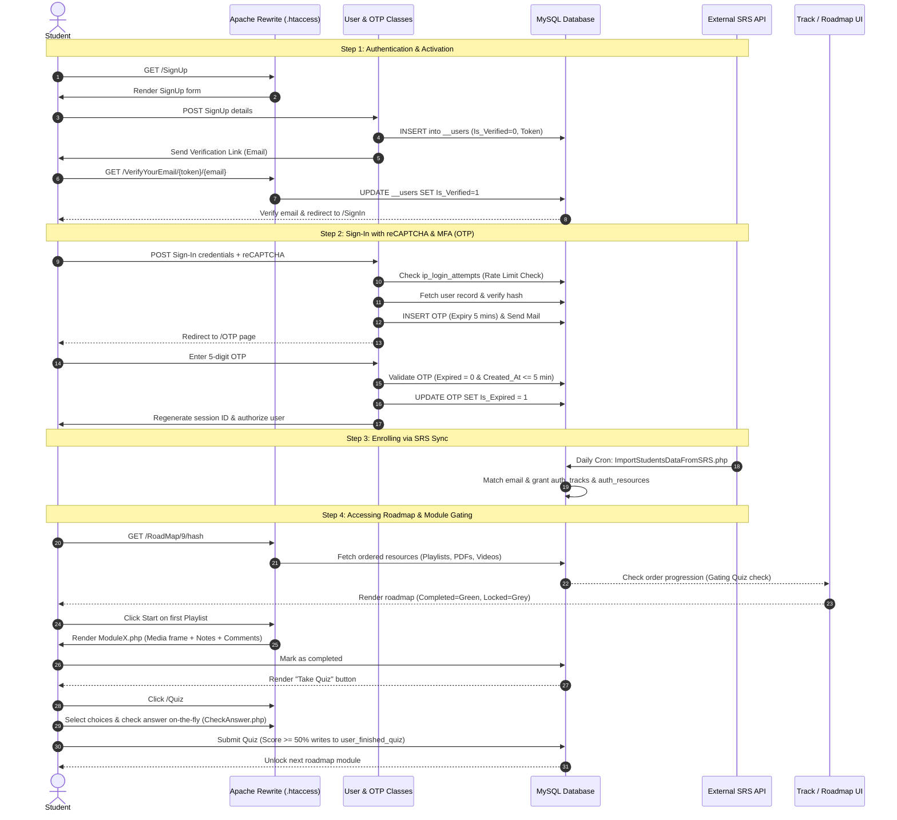

# K-Hub: Detailed Technical Architecture & Portfolio Analysis

---

## 1. PROJECT OVERVIEW

### Business and Product Perspective
**K-Hub (Knowledge-Hub)** is an integrated, community-driven E-Learning and Social Network platform designed to streamline and gamify technical education. Built originally as a graduation project at Helwan University (Fall 2022), it addresses a fundamental friction in self-directed software engineering education: the fragmentation of learning materials across the web (e.g., YouTube playlists, PDFs, technical articles) and the isolation self-learners experience when they get stuck.

Rather than hosting heavy video files locally, K-Hub acts as a structured cataloging layer that organizes external web resources (embedded via iframe) into logical, step-by-step linear learning curriculums called **Tracks**. By framing learning as a structured progression gated by interactive quizzes, it translates raw material into a gamified, incremental roadmap.

### The Core Problem Solved
1. **Curated Structure vs. Information Overload**: Instead of browsing chaotic search results, a student enrolls in a track (e.g., Programming in C++, OOP in Java, or Advanced Database systems) and is presented with a linear sequence of learning modules.
2. **Peer-to-Peer Gated Help Workspace**: Standard forums often lead to slow replies or public shaming. K-Hub features an "Ask For Help" mechanic that links students requesting support directly with peers who share matching interest tags via a real-time private chat workspace, rewarding helpers with Experience Points (XP) to promote collaboration.
3. **Institutional Integration**: The platform features synchronization pipelines to import student registrations directly from Helwan University's Student Records System (SRS), facilitating university course integration.

### Core Backend Responsibilities
The backend, built using custom Object-Oriented PHP 8, is responsible for:
- **Linear State Machine Gating**: Restricting access to advanced modules until prerequisite quizzes are completed.
- **Dynamic Curriculum Rendering**: Resolving and sorting resource sequences (Playlists, Videos, PDFs, Articles) from a normalized MySQL database.
- **Secured Authentication & Dynamic Cryptography**: Providing custom symmetric cookie encryption for sessions, sliding-window rate-limiting on login forms, and a fully designed asymmetric RSA end-to-end encryption pipeline for chats.
- **Real-Time Polling Engine**: Fueling chat history, read-status notifications, typing indicators, and user presence indicators using optimized Ajax routing.
- **External Integration Syncs**: Providing command-line worker scripts that parse external APIs and execute atomic database transactions for user imports.
- **DevOps & Containerization**: Operating via Docker and continuous integration pipelines (Jenkins) to automate compilation, testing, and deployment workflows.

---

## 2. FEATURE DISCOVERY

### A. Core Educational Engine
*   **Linear Learning Pathways (Tracks & Modules)**:
    *   *What it does*: Structures learning linearly. Users must finish each module and pass its associated quiz to unlock subsequent modules.
    *   *Backend location*: [Tracks.php](file:///d:/laragon/www/K-Hub/class/Tracks.php), [RoadMap.php](file:///d:/laragon/www/K-Hub/class/RoadMap.php).
    *   *Implementation*: Resolves resources across four tables (`__playlist`, `__article`, `__pdf`, and `__videos`) using track sequence indexing (`ItsOrder`). The method `getOrderOfLastQuiz` isolates the user's progress and locks all modules that are index-greater.
*   **Resource Type Polymorphism**:
    *   *What it does*: Unifies completely different resource types under a single interface.
    *   *Backend location*: [ResourceX.php](file:///d:/laragon/www/K-Hub/class/ResourceX.php), [ResourceTypes.php](file:///d:/laragon/www/K-Hub/class/enum/ResourceTypes.php).
    *   *Implementation*: Employs the `ResourceTypes` enum and dynamic table mapping array strategies in `ResourceX.php`. Whether fetching comments, replies, completion status, or user notes, the system automatically redirects queries to `comment_video`, `comment_playlist_videos`, `comment_pdf`, or `comment_article` dynamically based on the resource type mapping.
*   **Interactive Quizzing Engine**:
    *   *What it does*: Tests students immediately upon module completion.
    *   *Backend location*: [AjaxQuiz.php](file:///d:/laragon/www/K-Hub/App/Quiz/AjaxQuiz.php), [CheckAnswer.php](file:///d:/laragon/www/K-Hub/App/Quiz/CheckAnswer.php), [QuizIsCompleted.php](file:///d:/laragon/www/K-Hub/App/Quiz/QuizIsCompleted.php).
    *   *Implementation*: The client slides from question to question. The backend receives Ajax verification calls in `CheckAnswer.php` to validate choices against database correct answers on the fly. Passing scores (>= 50%) call `QuizIsCompleted.php` to write user achievements into the database.

### B. Communication & Collaboration Workspace
*   **Peer-to-Peer Help Dispatcher**:
    *   *What it does*: Matches stuck students with qualified helpers.
    *   *Backend location*: [HelpOthers.php](file:///d:/laragon/www/K-Hub/class/HelpOthers.php), [HelpOthersPage](file:///d:/laragon/www/K-Hub/Pages/HelpOthers.php).
    *   *Implementation*: Gated subquery filtering routes questions to the helper's "Help Others" page only if the question's skill tag matches the interests selected by the helper during registration.
*   **Presence Tracking & Typestate Indication**:
    *   *What it does*: Informs chat participants of online state and active typing.
    *   *Backend location*: [Chat.php](file:///d:/laragon/www/K-Hub/class/Chat.php), [DatabaseConfiguration.php](file:///d:/laragon/www/K-Hub/Config/DatabaseConfiguration.php#L117-L135).
    *   *Implementation*: Online state is determined on-demand by checking if a user's `Last_Seen` database timestamp is within 10 seconds of the current server time. Active typing states are managed in the `is_typing` table via AJAX events.

### C. Social Networking Platform
*   **Follower Graph**:
    *   *What it does*: Connects users and aggregates news feeds.
    *   *Backend location*: [ForProfile.php](file:///d:/laragon/www/K-Hub/Modules/ForProfile.php#L304-L398).
    *   *Implementation*: Maintained in the `__follow` table via basic queries. Feeds are generated dynamically in [ForNewsFeed.php](file:///d:/laragon/www/K-Hub/Modules/ForNewsFeed.php) by joining followed IDs with post media tables.
*   **Unified Media Newsfeed**:
    *   *What it does*: Implements an infinite scroll feed showing text, image, and video posts.
    *   *Backend location*: [NewsFeed.php](file:///d:/laragon/www/K-Hub/Pages/NewsFeed.php), [ForNewsFeed.php](file:///d:/laragon/www/K-Hub/Modules/ForNewsFeed.php).
    *   *Implementation*: Implements database-level pagination via offset queries (`LIMIT 10 OFFSET ?`) joining post content tables with the follow graph.
*   **Profile Visitor Auditing (Premium Feature)**:
    *   *What it does*: Tracks and displays users who viewed a profile.
    *   *Backend location*: [ForProfile.php](file:///d:/laragon/www/K-Hub/Modules/ForProfile.php#L486-L510).
    *   *Implementation*: Auditing is tracked inside `WhoVisitedYourProfile`. It checks if a record exists in `visited_profile` for the two users. It updates the date dynamically to `NOW()` on refresh or performs a new insert if they are visiting for the first time.

### D. Security & Access Gating
*   **Security Gated URLs**:
    *   *What it does*: Sanitizes GET parameters to prevent URL tampering.
    *   *Backend location*: [DatabaseConfiguration.php](file:///d:/laragon/www/K-Hub/Config/DatabaseConfiguration.php#L103-L115).
    *   *Implementation*: Parameters like `ProfileID` or `TrackID` are appended with a cryptographic signature calculated using `sha1($ID . 'salt')`. Access is blocked if the verification parameter (`uuid`) does not match the signature.
*   **Sliding-Window Rate Limiting**:
    *   *What it does*: Thwarts brute-force sign-in attempts.
    *   *Backend location*: [RateLimiter.php](file:///d:/laragon/www/K-Hub/class/RateLimiter.php).
    *   *Implementation*: Form submissions track failed attempts in `ip_login_attempts`. If 5 failures occur in 2 minutes, the system blocks requests and computes the cooldown dynamically using time intervals.

---

## 3. SYSTEM WALKTHROUGH

### The Student Journey (Production Simulation)



---

## 4. ARCHITECTURE EXPLANATION

```
K-Hub Workspace Directory Layout:
├── Config/
│   └── DatabaseConfiguration.php   # Connection setup, error logs, and URL hash guards
├── class/                         # Core OOP Model classes (App Namespace)
│   ├── enum/
│   │   └── ResourceTypes.php       # Enums for Video, Playlist, PDF, Article
│   ├── DB.php                      # Custom MySQLi Query Builder & ORM
│   ├── Encryption.php              # Cryptographic framework (AES-256, RSA-4096)
│   ├── User.php                    # Authentication, login history, profiles
│   ├── RoadMap.php                 # Learning linear pathways compilation
│   ├── Chat.php                    # Presence, unread receipts, and contact lists
│   └── ...
├── Pages/                         # Controller pages (Target of htaccess routes)
│   ├── index.php
│   ├── SignIn.php
│   ├── Profile.php
│   └── ...
├── App/
│   ├── Chat/                      # Chat UI templates & Polling AJAX routines
│   │   ├── Chat.php
│   │   └── ajax/ (realTimeChat.php, insertMessage.php, TypingOrNot.php)
│   └── Quiz/                      # Quiz UI templates & validation AJAX routines
├── DevOps/                        # Infrastructure, Jenkins pipelines, Docker setup
├── Scripts/                       # Command-line synchronizers & tasks
├── Views/                         # UI Components & Templates
└── .htaccess                      # MVC-style Apache URL rewrite manager
```

### Routing & Request Flow
K-Hub operates on an MVC-style architecture mapped directly via Apache's URL Rewrite engine.
1. When a user requests a clean URL (e.g., `/Profile/20/4a5b`), Apache parses the `.htaccess` rules in [htaccess](file:///d:/laragon/www/K-Hub/DevOps/htaccess%20Hostinger%20LTS) and routes the request internally to `Pages/Profile.php?ProfileID=20&uuid=4a5b`.
2. The page acts as a Page Controller, executing authentication checks via `User::auth()` and loading components from the `Views/` directory.
3. Database requests are delegated to core utility classes located inside the `class/` directory.

### Key Separation of Concerns
*   **Persistence Abstraction**: Business logic classes do not write raw SQL queries directly. They delegate CRUD actions to [DB.php](file:///d:/laragon/www/K-Hub/class/DB.php), which abstract connection logic, auto-detect data types, and run prepared SQL statements securely.
*   **AJAX Separation**: Interactive widgets (chats, quizzes, typing states) decouple their rendering logic from controller pages. They query dedicated micro-services inside `App/Chat/ajax/` or `App/Quiz/` that output JSON responses or direct HTML snippets.

---

## 5. COMPLEXITY AND ENGINEERING ASSESSMENT

Below is an engineering scorecard evaluation of the K-Hub repository:

| Category | Score (0-100) | Technical Justification |
| :--- | :---: | :--- |
| **Backend Engineering Complexity** | **85** | High implementation complexity due to a custom-built query builder, custom rate limiting, dynamic time math, and a sophisticated asymmetric RSA keypair generator. |
| **Architecture Quality** | **78** | Good separation of concerns with standard Page Controller models. PHP namespaces (`App\\`) are correctly registered via PSR-4. However, reliance on global database connections and static class structures limits unit-testing flexibility. |
| **Scalability** | **68** | The real-time chat engine relies on JQuery polling (`setInterval` hitting the database every 1 second). This creates severe performance limitations under load. Implementing WebSockets (e.g., Ratchet or Pusher) is required for true scalability. |
| **Security** | **82** | Excellent safeguards: parameterized MySQLi prepared statements throughout, reCAPTCHA integration, CSRF validation tokens, secure URL parameter hashing, and AES-256 cookie encryption. |
| **Database Design** | **79** | Good layout for educational tracking. Polymorphic resource relations are split across distinct tables (`__playlist`, `__pdf`, etc.) and mapped via type integers. Indexes on tables like `__chat` and `ip_login_attempts` are necessary for scale. |
| **API Design** | **72** | The backend relies on ad-hoc Ajax routes rather than a standardized RESTful API. However, the external SRS client integration is robustly designed with safe schema fallbacks. |
| **Maintainability** | **75** | Code files are focused. Class-level encapsulation reduces duplicate logic. However, dead code blocks and commented-out configurations (e.g. key validation in chats) suggest a rushed development cycle. |
| **Code Quality** | **78** | Clean coding standards are generally met. Variables have descriptive names. The presence of residual Git merge conflict markers in [AddQuizQuestion.php](file:///d:/laragon/www/K-Hub/__Admins__/AddQuizQuestion.php#L138-L142) shows a lack of final code review before code freeze. |
| **Production Readiness** | **72** | Strong deployment foundations: includes dynamic log separation for error handling, Docker configuration, and a Jenkinsfile. Real-time chat polling is the main bottleneck for staging to production. |
| **Testing Strategy** | **10** | Weak. No automated PHPUnit test suites are configured. The `Test/` folder contains UI assets rather than unit tests. Testing is limited to manual end-to-end user checks. |

### Overall Scores
*   **Overall Project Complexity Score**: **82 / 100**
*   **Overall Engineering Maturity Score**: **76 / 100**
*   **Estimated Developer Seniority**: **Strong Mid-Level**

*Justification*: The developer demonstrates capabilities that border on **Senior** in security awareness, cryptography design, infrastructure setup, and transaction handling. The custom database prepared statements engine and Jenkins pipeline are advanced. However, the use of short-polling for real-time systems, minor copy-paste duplication, and the lack of unit test suites place this project at a Strong Mid-Level standard.

---

## 6. ADVANCED ENGINEERING ANALYSIS

### A. End-to-End Chat Cryptography (Asymmetric RSA)
*   **How it works**: Located in [Encryption.php](file:///d:/laragon/www/K-Hub/class/Encryption.php#L56-L194). When a chat session starts, `generateKeysForChatSession` creates two distinct 4096-bit RSA keypairs (Key1 for User A, Key2 for User B) via OpenSSL and stores them under a sorted, combined user ID token.
    *   *Encryption*: The sender encrypts the message using the recipient's public key (`openssl_public_encrypt`). The resulting ciphertext is then signed using the sender's private key (`openssl_sign` with `OPENSSL_ALGO_SHA256`) to ensure integrity. The payload is concatenated as: `base64_encode($encryptedMessage . ":::" . $signature)`.
    *   *Decryption*: The receiver splits the payload, verifies the signature using the sender's public key, and decrypts the contents using their own private key.
*   **Why it was needed**: To prevent database administrators or malicious interceptors from viewing private student discussions.
*   **Engineering Difficulty**: **Very High (92/100)**. Managing RSA key rotation, computing asymmetric signatures, and dealing with key parsing boundaries in PHP is complex.
*   **Professional Impression**: Highly impressive design. However, the actual AJAX script (`insertMessage.php`) currently has the encryption routines commented out. Restoring this integration would be an excellent showcase feature.

### B. Custom Database Parameter Binding Abstraction
*   **How it works**: Located in [DB.php](file:///d:/laragon/www/K-Hub/class/DB.php#L81-L188). Standard mysqli requires manual parameter type declarations (`s`, `i`, `d`). This custom class resolves parameter types automatically in `SQLBindString` using `gettype()`. It then compiles argument references dynamically into an array and invokes the query using:
    `call_user_func_array(array($Query, 'bind_param'), $BindArr);`
*   **Why it was needed**: To avoid repetitive connection boilerplate across controllers and enforce safe SQL execution.
*   **Engineering Difficulty**: **Medium-High (78/100)**. Dynamic array parameter references are difficult to debug in PHP.
*   **Professional Impression**: Clean, reliable utility. It implements an ORM-like API syntax (e.g. `DB::table('__users')->select(...)`) that mimics Laravel Eloquent.

### C. Atomic Synchronization Transaction Engine
*   **How it works**: Located in [ImportStudentsDataFromSRS.php](file:///d:/laragon/www/K-Hub/Scripts/ImportStudentsDataFromSRS.php). This script runs via CLI. It authenticates with Helwan University's student records API using cURL Basic Auth, validates schema payload structures, and executes updates within an explicit database transaction:
    ```php
    $connection->begin_transaction();
    // ... insertUser, upsertStudentData, grantTrackResources ...
    $connection->commit();
    ```
    If any error occurs, it rolls back changes in the catch block: `$connection->rollback()`.
*   **Why it was needed**: To prevent incomplete imports and maintain data integrity in the event of networking issues during data syncs.
*   **Engineering Difficulty**: **Medium (70/100)**. Requires managing nested transaction states and handling data mapping logic safely.
*   **Professional Impression**: Highly professional execution. It includes logging and validation check exceptions.

### D. Jenkins Continuous Integration & Containerization
*   **How it works**: Defined in [jenkinsfile](file:///d:/laragon/www/K-Hub/DevOps/jenkinsfile) and [dockerfile](file:///d:/laragon/www/K-Hub/DevOps/dockerfile). The Jenkins pipeline automatically pulls code modifications from GitHub, builds a Docker image on Ubuntu wrapping a custom XAMPP installation, pushes it to Docker Hub, pulls it onto the target server, and deploys it on Port 80, sending deployment alerts to Slack.
*   **Why it was needed**: To automate application staging and coordinate deployments.
*   **Engineering Difficulty**: **Medium-High (75/100)**. Setting up a customized XAMPP installation inside an Ubuntu Docker environment is an atypical setup.
*   **Professional Impression**: Excellent infrastructure practices. It demonstrates strong DevOps competency.

---

## 7. MOST CHALLENGING PARTS OF THE SYSTEM

Here are the most technically challenging areas of the project, ranked from easiest to hardest:

### 4. Sliding-Window Rate Limiter
*   **Why it is difficult**: Requires computing date intervals across database rows dynamically. Managing time zone differences between database and PHP processes can cause timing bugs.
*   **Knowledge required**: Time calculations in MySQL, timezone normalization, sliding-window algorithms.
*   **Common implementation mistakes**: Hardcoding block duration windows or ignoring server timezone offsets.
*   **Capable Engineer level**: *Mid-Level*.

### 3. Course Access state-machine (Roadmap Gating)
*   **Why it is difficult**: Gating user access across modular resources involves evaluating complex conditions. The system must query dynamic order indexes and pass/fail tables across multiple databases simultaneously.
*   **Knowledge required**: Polymorphic database relations, array sorting strategies, linear state progression.
*   **Common implementation mistakes**: Performance bottlenecks due to N+1 query loops while rendering lists.
*   **Capable Engineer level**: *Strong Mid-Level*.

### 2. External API Student Synchronizer
*   **Why it is difficult**: Integrations must handle data format variations, network drops, and schema changes gracefully. Operating transactional rollbacks requires proper structure.
*   **Knowledge required**: MySQL transactional isolation, cURL integrations, CLI scripting, error handling.
*   **Common implementation mistakes**: Failing to use transactions, resulting in orphaned student profiles when imports fail midway.
*   **Capable Engineer level**: *Strong Mid-Level / Senior*.

### 1. Asymmetric End-to-End Chat Cryptography
*   **Why it is difficult**: Generating OpenSSL 4096-bit RSA keys, managing digital signatures, handling string encoding, and implementing verification routines is highly complex. A single misconfigured key boundary will break decryption.
*   **Knowledge required**: PKI standards, RSA mathematics, digital signatures, OpenSSL PHP configurations.
*   **Common implementation mistakes**: Storing raw unencrypted private keys in plaintext or failing to sign payloads.
*   **Capable Engineer level**: *Senior / Lead*.

---

## 8. RESUME AND PORTFOLIO EVALUATION

### Resume Impact Summary
If this project were presented in a portfolio, it would stand out immediately. While many junior and mid-level portfolios feature template-based CRUD apps built with pre-packaged frameworks, K-Hub showcases **architectural depth** and a strong grasp of **first-principles engineering**.

### What Stands Out to Hiring Managers
*   **Security Focus**: The inclusion of dynamic rate limiters, URL parameters signature validation, and MFA highlights a proactive approach to security.
*   **Production Deployment Pipeline**: Incorporating Jenkins, Slack webhooks, and Docker demonstrates that the candidate writes code with deployment and operations in mind.
*   **Third-Party System Integration**: The student import script proves the developer is capable of building real-world enterprise integrations.

### What Stands Out to Architects and Tech Leads
*   **Custom DB Layer**: Writing a custom ORM wrapper on MySQLi using PHP array references and `call_user_func_array` shows a deep understanding of PHP's internals.
*   **Asymmetric Cryptography**: The implementation of an OpenSSL RSA 4096-bit signature scheme demonstrates advanced mathematical and security engineering competence.
*   **Transactional Integrity**: Implementing transaction safety blocks in sync workers indicates a strong appreciation for database consistency.

### Standard Elements
*   **JQuery Short Polling**: Using Ajax polling for chats is standard but outdated. A tech lead will challenge why the developer did not implement WebSockets (e.g. Ratchet or Pusher).
*   **Procedural Code Mixes**: While the class modules are clean OOP, the view files mix raw PHP logic with HTML tags, reflecting older PHP practices.

### Recommended Interview Discussion Topics
1.  **The Cryptography Implementation**: Discuss the details of the asymmetric public/private key envelope design and how to securely rotate keys.
2.  **Transition to WebSockets**: Explain how to replace JQuery AJAX chat polling with an asynchronous WebSocket server (like Ratchet/Swoole) to reduce database load.
3.  **Refactoring to PDO**: Explain the advantages of migrating the database layer to PDO for improved database portability.

---

## 9. DETAILED PROJECT MEMORY DOCUMENT

*Save this narrative document as a refresher to quickly rebuild context if you return to this codebase in the future.*

### System Architecture and Purpose
K-Hub was designed as an integrated e-learning and social community platform to structure external web learning materials into curated, progressive learning pathways. Rather than downloading and storing video media locally, the platform catalogs references to external URLs and frames them within a linear sequence of modules. It operates on a custom MVC pattern, managing routes via Apache rewrite rules (`.htaccess`). Namespace mappings are loaded via PSR-4 autoloading through Composer.

The platform provides a social newsfeed feed, a peer tutoring system that routes questions based on interest tag matches, profile customization, profile visitor logs, and gating quizzes.

### Critical Engineering Decisions
1.  **Custom Database Engine**: Instead of using an off-the-shelf library, the system abstracts database interactions using a custom query builder wrapping PHP's `mysqli` class. It manages type inference and uses references to bind parameters dynamically.
2.  **Cryptographic Security**: Cookies are encrypted using AES-256-CBC with SHA-256 key hashing to prevent user spoofing. Chat communications feature an asymmetric envelope security scheme leveraging OpenSSL RSA-4096 and SHA-256 signatures to ensure message privacy.
3.  **Robust CLI Sync Workers**: Integrations with external databases (e.g. Helwan University SRS) run via command-line scripts. These scripts use curl requests to import and validate student records, running within explicit MySQL transactions to guarantee data integrity.
4.  **DevOps Pipeline**: The code is packaged into a Docker image wrapping XAMPP on an Ubuntu base. Continuous integration is managed via a Jenkins pipeline that runs builds, updates target servers, and posts status notifications to Slack.

### System Strengths & Weaknesses
*   *Strengths*: Excellent security design, clean routing layout, reusable database abstraction wrapper, robust integration scripts, and a structured deployment pipeline.
*   *Weaknesses*: Chat polling puts heavy load on the database, procedural code is occasionally mixed with HTML views, the project lacks unit test suites, and there are leftover merge conflict markers in [AddQuizQuestion.php](file:///d:/laragon/www/K-Hub/__Admins__/AddQuizQuestion.php#L138-L142).

---

## 10. FINAL VERDICT

*   **Overall Complexity Score**: **82 / 100**
*   **Overall Engineering Maturity Score**: **76 / 100**
*   **Estimated Effort (1 Developer)**: **3.5 - 4 Months** (from scratch)
*   **Target Developer Level**: **Strong Mid-Level / Senior**

### Most Impressive Aspects
1.  **Asymmetric Chat Cryptography**: Implementing digital envelope encryption and signatures using raw OpenSSL in custom PHP shows advanced capability.
2.  **Custom Query Builder**: Creating a dynamic parameter binder shows a strong understanding of low-level PHP programming.
3.  **DevOps Infrastructure**: The inclusion of automated Docker packaging and a complete Jenkins CI/CD pipeline is highly professional.

### Weakest Aspects
1.  **AJAX Polling Bottlenecks**: Polling the database every second for chats will degrade server performance under load.
2.  **Mixed Templates**: Mixing procedural PHP logic with HTML markup in view components reduces template maintainability.
3.  **Merge Conflict Markers**: The presence of unresolved Git merge markers in administrative code indicates a lack of final code quality checks.

### Key Lessons Demonstrated
*   **Security-First Coding**: Prioritizing input sanitization, rate limiting, and parameter signing is essential for production applications.
*   **Modular Architecture**: Separating core logic into encapsulated helper classes simplifies extension and maintenance.
*   **CI/CD Integration**: Incorporating automated deployment pipelines early in the development lifecycle ensures consistent, reliable releases.
