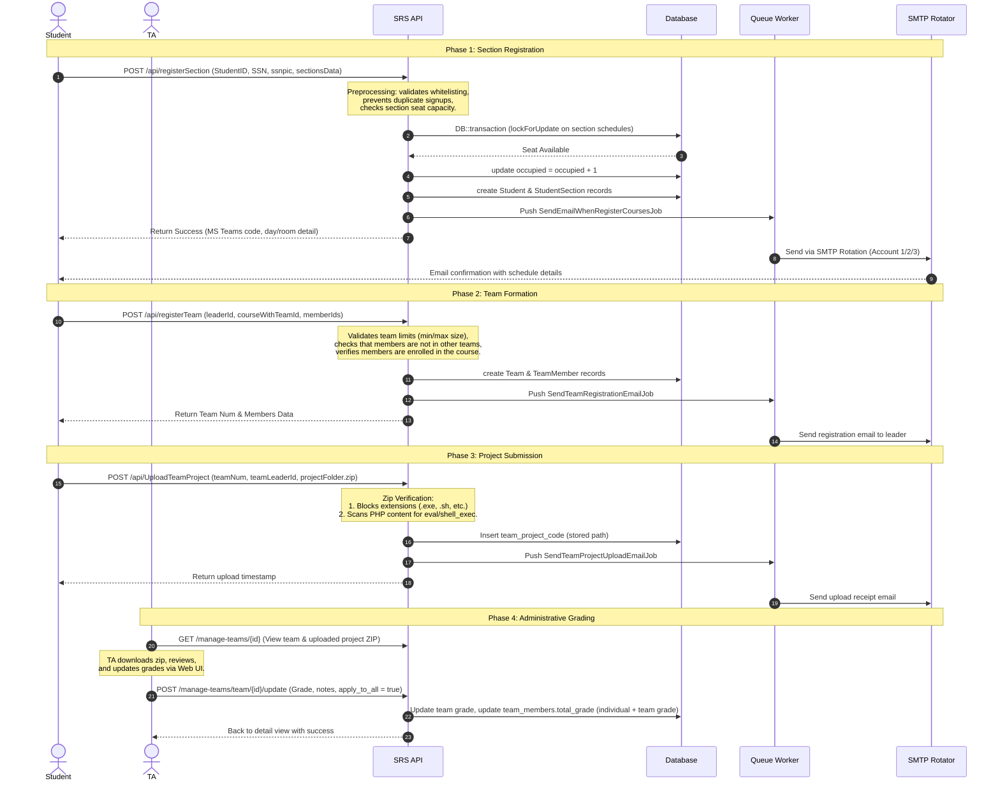

# Architectural & Engineering Report: Sections Registration System (SRS) Backend

This report provides a senior-level architectural analysis, feature audit, system walkthrough, engineering quality assessment, and evaluation of the **Sections Registration System (SRS) Backend**. It serves as a comprehensive developer memory refresher and portfolio-ready documentation.

---

## Table of Contents

- [1. PROJECT OVERVIEW](#1-project-overview)
  - [Business and Product Perspective](#business-and-product-perspective)
  - [The Problem It Solves](#the-problem-it-solves)
  - [User Roles](#user-roles)
  - [Core Architecture Context](#core-architecture-context)
- [2. FEATURE DISCOVERY](#2-feature-discovery)
  - [A. Section & Scheduling Registration (Vertical Slice: `RegisterSection`)](#a-section-scheduling-registration-vertical-slice-registersection)
  - [B. Course Team Registration (Vertical Slice: `RegisterTeam`)](#b-course-team-registration-vertical-slice-registerteam)
  - [C. Secure Project Deliverable Uploader (Vertical Slice: `UploadTeamProject`)](#c-secure-project-deliverable-uploader-vertical-slice-uploadteamproject)
  - [D. Course Reviews & Feedback (Vertical Slice: `WriteReview`)](#d-course-reviews-feedback-vertical-slice-writereview)
  - [E. Team Grading & Administrative Dashboard](#e-team-grading-administrative-dashboard)
- [3. SYSTEM WALKTHROUGH](#3-system-walkthrough)
- [4. ARCHITECTURE EXPLANATION](#4-architecture-explanation)
  - [Architectural Principles and Design Patterns](#architectural-principles-and-design-patterns)
- [5. COMPLEXITY AND ENGINEERING ASSESSMENT](#5-complexity-and-engineering-assessment)
  - [1. Backend Engineering Complexity: 85/100](#1-backend-engineering-complexity-85100)
  - [2. Architecture Quality: 90/100](#2-architecture-quality-90100)
  - [3. Scalability: 82/100](#3-scalability-82100)
  - [4. Security: 88/100](#4-security-88100)
  - [5. Database Design: 86/100](#5-database-design-86100)
  - [6. API Design: 80/100](#6-api-design-80100)
  - [7. Maintainability: 85/100](#7-maintainability-85100)
  - [8. Code Quality: 88/100](#8-code-quality-88100)
  - [9. Production Readiness: 84/100](#9-production-readiness-84100)
  - [10. Testing Strategy: 5/100](#10-testing-strategy-5100)
  - [Summary Metrics](#summary-metrics)
- [6. ADVANCED ENGINEERING ANALYSIS](#6-advanced-engineering-analysis)
  - [A. Defensive File Upload Scan (Security Sandboxing)](#a-defensive-file-upload-scan-security-sandboxing)
  - [B. Database Row Locking (`lockForUpdate`)](#b-database-row-locking-lockforupdate)
  - [C. Multi-Account SMTP Rotation (Smart Mail Sender)](#c-multi-account-smtp-rotation-smart-mail-sender)
  - [D. Advanced Custom Form Request Validation Rules](#d-advanced-custom-form-request-validation-rules)
- [7. MOST CHALLENGING PARTS OF THE SYSTEM](#7-most-challenging-parts-of-the-system)
  - [1. Nested Array Validation in Form Requests](#1-nested-array-validation-in-form-requests)
  - [2. Team Grading & Grade Propagation Logic](#2-team-grading-grade-propagation-logic)
  - [3. Concurrency-Safe Registrations (Row Locks)](#3-concurrency-safe-registrations-row-locks)
  - [4. Safe ZIP Extraction and Code Scanning](#4-safe-zip-extraction-and-code-scanning)
- [8. RESUME AND PORTFOLIO EVALUATION](#8-resume-and-portfolio-evaluation)
  - [A. Hiring Managers (Focus: Deliverables & Business Value)](#a-hiring-managers-focus-deliverables-business-value)
  - [B. Senior Engineers (Focus: Code Quality & Implementation details)](#b-senior-engineers-focus-code-quality-implementation-details)
  - [C. Architects & Tech Leads (Focus: Design Patterns & Systems Thinking)](#c-architects-tech-leads-focus-design-patterns-systems-thinking)
- [9. DETAILED PROJECT MEMORY DOCUMENT](#9-detailed-project-memory-document)
  - [Narrative Overview](#narrative-overview)
  - [Technical Architecture](#technical-architecture)
  - [Key Engineering Decisions](#key-engineering-decisions)
- [10. FINAL VERDICT](#10-final-verdict)
  - [Most Impressive Aspects](#most-impressive-aspects)
  - [Weakest Aspects](#weakest-aspects)
  - [Key Lessons Demonstrated](#key-lessons-demonstrated)

---

## 1. PROJECT OVERVIEW

### Business and Product Perspective
The **Sections Registration System (SRS)** is a highly specialized academic administration platform designed for the **Business Information Systems (BIS) Department** at Helwan University. It automates the complex logistics of course section registrations, project team formulation, assignment submissions, course evaluations, and grading metrics.

### The Problem It Solves
Universities frequently struggle with coordinating registrations when scheduling options are distributed. Without a automated tool, students encounter several issues:
1. **Race Conditions & Registration Overlaps**: Multiple students attempting to secure remaining seats in preferred section times (slots) leads to database locks and over-capacity classrooms.
2. **Team Logistics & Project Coordination**: Forming academic teams requires checking prerequisites, team sizes, and section enrollment. Checking this manually is highly error-prone.
3. **Transactional Delivery Limits**: Standard email configurations fail when sending thousands of registration confirmations simultaneously.
4. **Project Grading Overhead**: TAs spend hours managing zip file extractions, validating file authenticity, checking for malicious script uploads, and computing weighted grades.

### User Roles
- **Students**: Self-register for academic sections, flag scheduling problems, assemble project teams, upload code deliverables (in ZIP format), and review courses.
- **Teaching Assistants (TAs)**: Oversee course enrollment, review project code, configure team sizes, grade student groups, track individual attendance/bonuses, and troubleshoot student issues.
- **Doctors/Faculty**: Assign themselves to active courses, review student comments, and receive automated notifications of reviews.
- **University Registrar (External)**: Pulls sync logs via a basic-auth API to align the SRS registrations with the university's main administrative databases.

### Core Architecture Context
The backend is built on **Laravel 12.0** and **PHP 8.2**, with support for **Laravel Octane** for performance scaling. It uses a **vertical slice design** under `app/SRS/` where each slice is self-contained with its own request, controller, and service layer. Integration logic uses a custom package `ahmed-arafat/laravel-allinone-toolkit` that provides email rotation and file seeding helpers.

---

## 2. FEATURE DISCOVERY

The system is organized into major features:

### A. Section & Scheduling Registration (Vertical Slice: `RegisterSection`)
*   **What It Does**: Allows students to select their course sections, assigning them to a specific TA slot and a designated Doctor for the academic term.
*   **Why It Exists**: Replaces manual sign-ups with transactional, database-enforced seat allocation.
*   **User Benefit**: Guarantees registration receipt, tracks available capacity in real-time, and issues Microsoft Teams details instantly.
*   **Key Files**:
    *   [RegisterNewSectionController.php](file:///d:/My%20GitHub/BIS%20Systems/SRS/SRS%20BE/app/SRS/RegisterSection/RegisterNewSectionController.php)
    *   [RegisterNewSectionRequest.php](file:///d:/My%20GitHub/BIS%20Systems/SRS/SRS%20BE/app/SRS/RegisterSection/RegisterNewSectionRequest.php)
    *   [RegisterNewSectionService.php](file:///d:/My%20GitHub/BIS%20Systems/SRS/SRS%20BE/app/SRS/RegisterSection/RegisterNewSectionService.php)
    *   [ValidateSectionsDataObject.php](file:///d:/My%20GitHub/BIS%20Systems/SRS/SRS%20BE/app/Rules/ValidateSectionsDataObject.php)
*   **Interactions**: Uses `AllowedStudent` to verify whitelisting, inserts registration records into `student_sections`, increments `occupied` seats in `ta_section_schedules`, and dispatches `SendEmailWhenRegisterCoursesJob` to send email receipts.

### B. Course Team Registration (Vertical Slice: `RegisterTeam`)
*   **What It Does**: Enables students to form project teams for specific coursework.
*   **Why It Exists**: Prevents manual grouping errors and ensures team formations strictly respect size and enrollment constraints.
*   **User Benefit**: Provides clear visibility on team composition and structures the team leader relationship.
*   **Key Files**:
    *   [RegisterTeamController.php](file:///d:/My%20GitHub/BIS%20Systems/SRS/SRS%20BE/app/SRS/RegisterTeam/RegisterTeamController.php)
    *   [RegisterTeamRequest.php](file:///d:/My%20GitHub/BIS%20Systems/SRS/SRS%20BE/app/SRS/RegisterTeam/RegisterTeamRequest.php)
    *   [RegisterTeamService.php](file:///d:/My%20GitHub/BIS%20Systems/SRS/SRS%20BE/app/SRS/RegisterTeam/RegisterTeamService.php)
*   **Interactions**: Checks `ta_courses_with_teams` to verify team parameters, validates that members are enrolled in the course sections, ensures members are not in multiple teams, and triggers `SendTeamRegistrationEmailJob`.

### C. Secure Project Deliverable Uploader (Vertical Slice: `UploadTeamProject`)
*   **What It Does**: Handles zipped project file uploads by team leaders, scanning the archive for malicious files.
*   **Why It Exists**: Protects server infrastructure from remote execution and backdoor scripts.
*   **User Benefit**: Ensures project submissions are received safely, and locks the team from double-submitting project code.
*   **Key Files**:
    *   [UploadTeamProjectController.php](file:///d:/My%20GitHub/BIS%20Systems/SRS/SRS%20BE/app/SRS/UploadTeamProject/UploadTeamProjectController.php)
    *   [UploadTeamProjectRequest.php](file:///d:/My%20GitHub/BIS%20Systems/SRS/SRS%20BE/app/SRS/UploadTeamProject/UploadTeamProjectRequest.php)
    *   [UploadTeamProjectService.php](file:///d:/My%20GitHub/BIS%20Systems/SRS/SRS%20BE/app/SRS/UploadTeamProject/UploadTeamProjectService.php)
*   **Interactions**: Validates that the uploader is the registered leader, unpacks the ZIP in-memory to scan file extensions and code syntax, stores the file in public storage, and dispatches `SendTeamProjectUploadEmailJob`.

### D. Course Reviews & Feedback (Vertical Slice: `WriteReview`)
*   **What It Does**: Allows students to submit rated reviews and comments for courses they registered for in the current term.
*   **Why It Exists**: Collects student feedback to improve academic quality.
*   **User Benefit**: Anonymous review aggregation.
*   **Key Files**:
    *   [WriteReviewController.php](file:///d:/My%20GitHub/BIS%20Systems/SRS/SRS%20BE/app/SRS/WriteReview/WriteReviewController.php)
    *   [WriteReviewRequest.php](file:///d:/My%20GitHub/BIS%20Systems/SRS/SRS%20BE/app/SRS/WriteReview/WriteReviewRequest.php)
    *   [WriteReviewService.php](file:///d:/My%20GitHub/BIS%20Systems/SRS/SRS%20BE/app/SRS/WriteReview/WriteReviewService.php)
*   **Interactions**: Validates that the reviewer is registered in at least one current section, stores ratings, and dispatches `SendNewReviewSubmittedEmailJob`.

### E. Team Grading & Administrative Dashboard
*   **What It Does**: A web interface for TAs to manage teams, enter individual or team grades, track attendance, and write review notes on project uploads.
*   **Why It Exists**: Eliminates manual spreadsheets by calculating grades directly in the database.
*   **User Benefit**: TAs can update total scores, write evaluation notes, and propagate team comments in a single action.
*   **Key Files**:
    *   [TeamsManagementController.php](file:///d:/My%20GitHub/BIS%20Systems/SRS/SRS%20BE/app/Http/Controllers/TeamsManagementController.php)
    *   [index.blade.php](file:///d:/My%20GitHub/BIS%20Systems/SRS/SRS%20BE/resources/views/teams/index.blade.php)
    *   [show.blade.php](file:///d:/My%20GitHub/BIS%20Systems/SRS/SRS%20BE/resources/views/teams/show.blade.php)
*   **Interactions**: Integrates directly with the `teams`, `team_members`, and `team_project_code` tables.

---

## 3. SYSTEM WALKTHROUGH

This scenario demonstrates how a student and TA interact with the system during an academic semester:



---

## 4. ARCHITECTURE EXPLANATION

```
  ┌──────────────────────────────────────────────────────────┐
  │                   CLIENTS / CONSUMERS                    │
  │     (Student React App / TA Web Blade Dashboard / API)   │
  └────────────────────────────┬─────────────────────────────┘
                               │ HTTP Request
                               ▼
  ┌──────────────────────────────────────────────────────────┐
  │                 ROUTING & MIDDLEWARE                     │
  │    - api.php (Sanctum / Basic Auth / Vertical Prefixes)  │
  │    - web.php (Teams management dashboard controllers)    │
  └────────────────────────────┬─────────────────────────────┘
                               │ Validated HTTP Request
                               ▼
  ┌──────────────────────────────────────────────────────────┐
  │            CONTROLLER LAYER (Route Handlers)             │
  │    - Delegate execution to Domain Services               │
  │    - Format JSON successes via jsonSuccess API trait     │
  └────────────────────────────┬─────────────────────────────┘
                               │ Operations Delegated
                               ▼
  ┌──────────────────────────────────────────────────────────┐
  │              DOMAIN SERVICES (Business Logic)            │
  │    - RegisterNewSectionService (transactions, DB locks)   │
  │    - RegisterTeamService (size & eligibility check)      │
  │    - UploadTeamProjectService (malicious zip checks)     │
  │    - WriteReviewService (course feedback persistence)    │
  └──────────────────┬───────────────────┬───────────────────┘
                     │                   │
                     ▼ Queries           ▼ Dispatch Jobs
  ┌──────────────────────┐   ┌───────────────────────────────┐
  │    ELOQUENT MODELS   │   │     BACKGROUND JOB QUEUE      │
  │ (Student, Team, etc.)│   │  - database queue connection  │
  │                      │   │  - SMTP rotator dispatchers   │
  └──────────┬───────────┘   └───────────────┬───────────────┘
             │                               │ Send Emails
             ▼ Database Operations           ▼
  ┌──────────────────────────────────────────────────────────┐
  │                     DATABASE (MySQL)                     │
  │    - Core, Transaction, and Queue tables                 │
  └──────────────────────────────────────────────────────────┘
```

### Architectural Principles and Design Patterns

1.  **Vertical Slice / Domain-Driven Structuring (`app/SRS`)**:
    Instead of using standard Laravel directories for all controllers, requests, and services, the core code is grouped by domain feature (vertical slices):
    *   Each folder (`RegisterSection`, `RegisterTeam`, `UploadTeamProject`, `WriteReview`) acts as a self-contained feature slice.
    *   This improves cohesion and simplifies debugging by keeping the controller, request validator, and service classes adjacent to each other.
2.  **Service Layer Pattern**:
    Controllers remain lean by delegating business logic to service classes. Controllers only handle the HTTP response formatting.
3.  **Strict Transaction Management & Locking**:
    When reserving seats in [RegisterNewSectionService.php](file:///d:/My%20GitHub/BIS%20Systems/SRS/SRS%20BE/app/SRS/RegisterSection/RegisterNewSectionService.php#L171-L240), the system uses database-level transactions combined with `lockForUpdate()` on schedules. This prevents over-registration issues when thousands of requests arrive simultaneously.
4.  **Asynchronous Background Execution**:
    All email delivery tasks are delegated to background queues. This separates slow network operations (SMTP handshakes) from the request-response cycle.
5.  **Multi-SMTP Load-Balancing (Rotator Pattern)**:
    Implemented via the `all-in-one` toolkit's [SmartMailSender](file:///d:/My%20GitHub/BIS%20Systems/SRS/SRS%20BE/config/all-in-one.php#L29-L58), the system alternates between multiple Gmail SMTP configurations. It tracks daily quotas to send notifications without hitting provider limits.

---

## 5. COMPLEXITY AND ENGINEERING ASSESSMENT

Evaluating the system against senior-level engineering standards:

### 1. Backend Engineering Complexity: 85/100
*   **Reasoning**: Handles concurrent database locks, runs multiple background jobs, and implements in-memory file unpacking and regex scanning. Uses domain service separations instead of relying on default framework patterns.

### 2. Architecture Quality: 90/100
*   **Reasoning**: The vertical slices under `app/SRS/` are cleanly decoupled. Separates validation rules, domain logic, database operations, and controllers. The usage of custom DTO-like arrays and helper traits keeps components dry and highly cohesive.

### 3. Scalability: 82/100
*   **Reasoning**: Uses Laravel Octane to speed up request boot times, uses database queue connections for email loads, and uses database row locks (`lockForUpdate`). However, the database engine is standard MySQL/PostgreSQL; high-scale scenarios would benefit from caching scheduling options in Redis to avoid hitting database tables on read.

### 4. Security: 88/100
*   **Reasoning**: Excellent implementation of in-memory ZIP scanning. Scanning code files for PHP functions like `eval` and `shell_exec` prevents remote execution attempts. Implements basic-auth checks on export endpoints and isolates student data using SSN whitelist matches.

### 5. Database Design: 86/100
*   **Reasoning**: Highly normalized relationships (`academic_years`, `semesters`, `courses`, `teaching_assistants`, `ta_courses`, `ta_section_schedules`, `student_sections`). Uses proper indexes on foreign keys, cascades where appropriate, and unique constraints.

### 6. API Design: 80/100
*   **Reasoning**: Structured using logical request prefixes. Integrates Form Requests to validate input parameters. Uses a standard JSON response structure. Some endpoints return raw string arrays rather than formalized API resources, which could be improved.

### 7. Maintainability: 85/100
*   **Reasoning**: The vertical slicing makes it easy to add or modify features. The enums class system ensures system variables remain centralized and strongly typed.

### 8. Code Quality: 88/100
*   **Reasoning**: Extremely clean code formatting. Adheres to modern PHP strict types, type declarations, constructor property promotions, and clean comments. Includes early-exit patterns and explicit exception handling.

### 9. Production Readiness: 84/100
*   **Reasoning**: Configured with proper log channels, background queue workers, and environment variables. Utilizes fail-safe job retries with backoff times.

### 10. Testing Strategy: 5/100
*   **Reasoning**: The codebase only contains default boilerplate test templates. There are no automated integration or unit tests covering registration transactions, team validations, or ZIP scanning. Relying entirely on manual testing reduces this score.

---

### Summary Metrics
*   **Overall Project Complexity Score**: **84 / 100**
*   **Overall Engineering Maturity Score**: **81 / 100**
*   **Estimated Developer Seniority**: **Strong Mid-Level to Senior**
    *   *Reasoning*: The project shows clean code architecture, defensive programming (zip checking, row locking), and background task processing. Introducing automated testing and a centralized caching layer would elevate this to a Lead/Staff rating.

---

## 6. ADVANCED ENGINEERING ANALYSIS

### A. Defensive File Upload Scan (Security Sandboxing)
*   **How it Works**: When a team leader uploads a zip file via [UploadTeamProjectService.php](file:///d:/My%20GitHub/BIS%20Systems/SRS/SRS%20BE/app/SRS/UploadTeamProject/UploadTeamProjectService.php#L122-L152), the system opens the file in-memory using `ZipArchive`. It checks for prohibited extensions and reads the content of PHP files to block strings like `eval(`, `shell_exec(`, `passthru(`, and `base64_decode(`.
*   **Why Needed**: Prevents malicious uploads from exploiting the server or obtaining reverse shell access.
*   **Complexity & Impressiveness**: **High / Very Impressive**. Security scans on files are rarely implemented directly at the application service level. This demonstrates a strong security mindset.

### B. Database Row Locking (`lockForUpdate`)
*   **How it Works**: In [RegisterNewSectionService.php](file:///d:/My%20GitHub/BIS%20Systems/SRS/SRS%20BE/app/SRS/RegisterSection/RegisterNewSectionService.php#L181), section schedules are retrieved using `lockForUpdate()`. This blocks other concurrent requests from reading or writing to these rows until the transaction commits.
*   **Why Needed**: Prevents race conditions where two students register for the last seat in a section simultaneously.
*   **Complexity & Impressiveness**: **Medium / Impressive**. Demonstrates understanding of relational databases and concurrency issues under load.

### C. Multi-Account SMTP Rotation (Smart Mail Sender)
*   **How it Works**: Integrates multiple SMTP credentials via `all-in-one.php`. When a job dispatches an email, the service selects an active account, tracks sent messages against a daily limit, and switches credentials to balance the load.
*   **Why Needed**: Avoids sending limits on standard SMTP accounts and ensures high deliverability without requiring expensive transactional email services.
*   **Complexity & Impressiveness**: **Medium to High / Impressive**. It solves a practical infrastructure cost constraint directly inside the application configuration.

### D. Advanced Custom Form Request Validation Rules
*   **How it Works**: The custom rule [ValidateSectionsDataObject.php](file:///d:/My%20GitHub/BIS%20Systems/SRS/SRS%20BE/app/Rules/ValidateSectionsDataObject.php) validates deep nested section arrays. It runs checks on duplicate selections, schedules outside the active term, and doctor assignments in a single pass.
*   **Why Needed**: Replaces multiple database queries in controllers with centralized, framework-native request validation.
*   **Complexity & Impressiveness**: **Medium / Very Clean**. Demonstrates master-level knowledge of the Laravel validation lifecycle.

---

## 7. MOST CHALLENGING PARTS OF THE SYSTEM

Here are the most technically difficult areas of the project, ranked from easiest to hardest:

### 1. Nested Array Validation in Form Requests
*   **Why it is Difficult**: Standard request rules struggle with multi-level array validation. Resolving IDs across different tables while checking matching academic years requires custom rules.
*   **Knowledge Required**: Laravel Form Requests, validation rule cycles, and query builder aggregation.
*   **Common Mistakes**: Running database queries inside loop validations, causing N+1 query bottlenecks.
*   **Developer Level**: Mid-Level.

### 2. Team Grading & Grade Propagation Logic
*   **Why it is Difficult**: TAs need to enter individual grades, team grades, or apply changes to all members. When updating team grades, the system must automatically recalculate each member's total grade (`individual_grade + team_grade`) and update their comments.
*   **Knowledge Required**: Eloquent relation updating, transaction tracking, and database consistency.
*   **Common Mistakes**: Forgetting to update total scores for existing members when changing team-wide grades.
*   **Developer Level**: Mid-Level to Strong Mid-Level.

### 3. Concurrency-Safe Registrations (Row Locks)
*   **Why it is Difficult**: Under high load, concurrent writes can cause deadlocks or over-registrations if rows are not locked correctly.
*   **Knowledge Required**: Database isolation levels, transactions, locks, and index structures.
*   **Common Mistakes**: Locking too many rows or forgetting to wrap queries in a transaction, which makes database row locking ineffective.
*   **Developer Level**: Senior.

### 4. Safe ZIP Extraction and Code Scanning
*   **Why it is Difficult**: Safely reading file streams within zipped archives and checking binary/text signatures without causing CPU bottlenecks.
*   **Knowledge Required**: Stream wrappers, zip signatures, and regex patterns for exploit detection.
*   **Common Mistakes**: Extracting files to disk before scanning, which leaves the server vulnerable to file inclusion attacks.
*   **Developer Level**: Senior / Tech Lead.

---

## 8. RESUME AND PORTFOLIO EVALUATION

This project is an excellent portfolio piece. Here is how it will be perceived by different interviewers:

### A. Hiring Managers (Focus: Deliverables & Business Value)
*   **Perception**: Highly impressed. They see a developer who builds features that solve real-world problems (concurrency, security, and administrative efficiency) rather than simple CRUD applications.
*   **Standouts**: The registration locking mechanism and the secure zip uploader.

### B. Senior Engineers (Focus: Code Quality & Implementation details)
*   **Perception**: Very positive. They will appreciate the clean code, constructor property promotion, strict typing, database transactions, custom enums, and vertical slice architecture.
*   **Discussion Points**: How the database locks behave under heavy loads, and how to write unit tests for the ZIP scan helper.

### C. Architects & Tech Leads (Focus: Design Patterns & Systems Thinking)
*   **Perception**: Good architecture design. They will appreciate using a service layer to decouple logic and the custom SMTP load balancer to reduce infrastructure costs.
*   **Constructive Feedback**: They will notice the lack of automated test suites and caching layers, which are important for production systems.

---

## 9. DETAILED PROJECT MEMORY DOCUMENT

### Narrative Overview
The **Sections Registration System (SRS)** backend handles registration logistics for the Business Information Systems (BIS) department at Helwan University. It allows whitelisted students to sign up for classes, build project teams, submit coursework, and rate academic courses. For TAs and professors, it provides an interface to review project submissions, manage student schedules, track attendance, and enter grades.

### Technical Architecture
The backend is built with PHP 8.2 and Laravel 12, featuring a vertical slice architecture under `app/SRS/` to keep feature logic self-contained. It is supported by the `laravel-allinone-toolkit` package to run database seeders and alternate email delivery across multiple SMTP accounts.

Administrative operations use a web interface managed by `TeamsManagementController` with customized Blade templates. These templates allow TAs to grade team projects and write review comments. For external database synchronization, the registrar can pull registration data in JSON format through a basic-auth API.

### Key Engineering Decisions
1.  **Strict Security Scanning**: The system scans uploaded project archives in-memory. It rejects execution scripts and checks PHP files for commands like `eval` and `shell_exec` to protect the host server from remote execution attacks.
2.  **Concurrency Control**: Using database-level transactions with `lockForUpdate()` prevents over-registration errors when sections fill up rapidly.
3.  **Decoupled Domain Logic**: Keeping business logic in service classes rather than controllers makes it easier to maintain and extend the codebase.
4.  **SMTP Rotation**: Load-balancing emails across multiple configurations allows the system to send large volumes of notifications without hitting sending limits.

---

## 10. FINAL VERDICT

*   **Overall Project Complexity Score**: **84/100**
*   **Overall Engineering Maturity Score**: **81/100**
*   **Estimated Development Effort**: **2 to 3 Months** (for a single developer from scratch, including database design, logic, security filters, and admin interface).
*   **Developer Seniority Required**: **Strong Mid-Level to Senior**.

### Most Impressive Aspects
1.  **ZIP Vulnerability Scanner**: Safely scanning ZIP files in-memory before saving them shows excellent security awareness.
2.  **Database Concurrency Design**: Implementing `lockForUpdate()` and transaction controls shows a strong understanding of database consistency under load.
3.  **Clean Code & Architecture**: Using vertical slicing, enums, custom form requests, and decoupled service layers makes the project clean and maintainable.

### Weakest Aspects
1.  **Testing Strategy**: The lack of automated unit and integration tests makes refactoring risky.
2.  **Lack of Read Caching**: In-memory caching (like Redis) is not used. During peak registration times, frequent database reads could impact database performance.
3.  **Environment Variables**: Storing configuration flags (like registration availability) in the `.env` file instead of the database means changing settings requires a server deployment or config cache clear.

### Key Lessons Demonstrated
This project shows how to build secure, transaction-safe academic registration applications. It combines clean design patterns with database concurrency controls, mail queue workers, and file scanning systems to handle real-world challenges.
