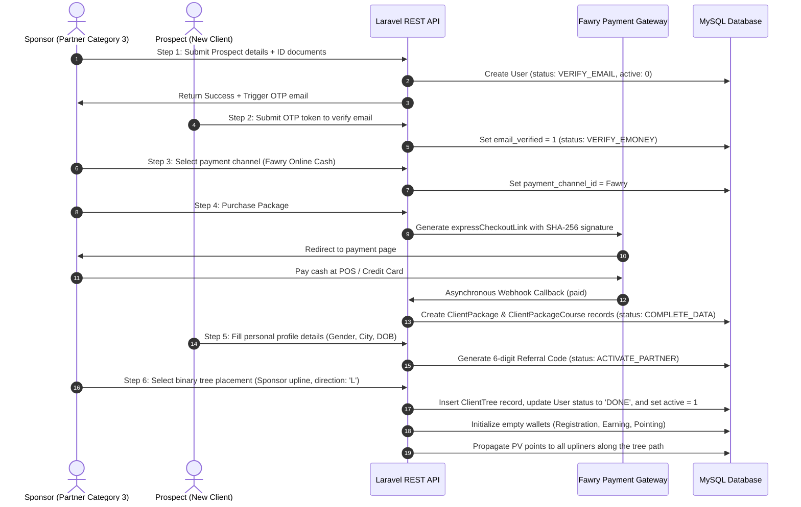

# WinLife Backend: Architectural Audit, Feature Discovery, & Engineering Assessment

This document serves as a comprehensive technical blueprint and retrospective audit of the **WinLife Backend Application
**. It is designed for engineers, senior architects, tech leads, and hiring managers to quickly grasp the product scope,
architectural sophistication, and technical achievements of the codebase after a period of inactive development.

---

## 1. PROJECT OVERVIEW

### Business and Product Perspective

**WinLife** is a sophisticated Multi-Level Marketing (MLM) platform integrated with an E-Learning core. It operates at
the intersection of network marketing and distance education. The product solves a major problem in MLM: providing
members (referred to as **Partners**) with high-value educational products (courses in trading, marketing, design, and
languages) while offering a transparent, highly automated, and real-time commission distribution engine.

### System Users

1. **Newcomers (Category 1):** Users who register to study foundational training courses. They have limited marketing
   abilities and represent the entry-level tier.
2. **Service-Only Partners (Category 2):** Partners focused purely on purchasing and consuming educational resources.
3. **Service & Marketing Partners (Category 3):** Active network builders who leverage the system's compensation
   structures, build downlines, earn commissions, and perform e-money transactions.
4. **Moderators / Admins:** Power users who verify bank payments, process manual cash settlements, manage system
   variables, oversee courses, and monitor the network's health.

### Major Workflows & Backend Responsibilities

* **Onboarding & Enrollment Wizard:** A multi-step registration flow that coordinates verification, payment channels,
  course selection, and binary tree node placement.
* **Binary Tree Management:** Real-time tree hierarchy tracking. Each node has a maximum of two branches (Left and
  Right).
* **Point Volume (PV) Flow:** When a partner purchases a package or course, Point Volumes (PV) flow up the binary tree
  to all active upliners, split between Left (L) and Right (R) legs.
* **Taswia (Weekly Settlement & Reconciliation):** A recurring batch settlement that analyzes tree balances, matches L/R
  legs of partners in cycles of 300 PV, handles payout caps, and flashout rules, and credits cash or points.
* **E-Money Ledger and Wallets:** A double-entry transaction ledger tracking E-Money across three wallet types:
  `Registration` (for purchasing packages), `Earning` (for receiving commissions/withdrawals), and `Pointing` (for
  non-cash reward points).

---

## 2. FEATURE DISCOVERY

### A. Onboarding & Partner Registration Wizard (Modular Steps)

* **Step 1: Personal Info & Document Verification:
  ** [AddNewClientStep1Service.php](file:///app/WinLife/ClientDashboard/AddNewClientSteps/Step1/AddNewClientStep1Service.php)
  collects personal details and handles the upload of National ID documents (`verification_image_front` and
  `verification_image_back`).
* **Step 2: Email & Phone Verification:** Uses a secure One-Time Password (OTP) verification
  mechanism ([AddNewClientStep2Service.php](file:///app/WinLife/ClientDashboard/AddNewClientSteps/Step2/AddNewClientStep2Service.php)).
* **Step 3: Payment Channel Selection:
  ** [AddNewClientStep3Service.php](file:///app/WinLife/ClientDashboard/AddNewClientSteps/Step3/AddNewClientStep3Service.php)
  configures how the package will be funded. Options include Sponsor Wallet transfer, Manual Bank Receipt verification (
  with admin approval), or Fawry Online Payment Gateway.
* **Step 4: Package Purchase & Enrollment:** Executes the
  transaction ([AddNewClientStep4Service.php](file:///app/WinLife/ClientDashboard/AddNewClientSteps/Step4/AddNewClientStep4Service.php)),
  binds courses to the partner account, and increments sponsor PV.
* **Step 5: Document Collection & Referral Code Generation:** Generates a unique, non-duplicable 6-digit random referral
  code ([AddNewClientStep5Service.php](file:///app/WinLife/ClientDashboard/AddNewClientSteps/Step5/AddNewClientStep5Service.php)).
* **Step 6: Binary Tree Placement & PV Propagation:** Automatically places the new partner in the binary tree under
  their specified upline in either the Left or Right
  position ([AddNewClientStep6Service.php](file:///app/WinLife/ClientDashboard/AddNewClientSteps/Step6/AddNewClientStep6Service.php)),
  then triggers upline point propagation.

### B. Binary Tree Hierarchy & Placement Engine

* **Tree Traversal Algorithms:** Uses Breadth-First Search (BFS) powered by `Ds\Queue` to fetch, list, and validate
  nodes.
* **Available Leg Search:** Locates free positions (Left or Right) under any upliner node using
  `getUplinerAvailableChildren`.
* **Upliner Chain Construction:** Climbs the binary tree recursively via `constructUplinerTreeWithDirectionCollection`
  to collect all parent IDs and node relationship positions (e.g., node X is on node Y's Left side).

### C. Compensation & Settlement Engine (Taswia)

* **Binary Matching Calculation:** Settles partners with cycles of 300 PV on Left and 300 PV on Right.
* **Payout Distribution:** Partners receive a standard commission (`PV_EMONEY_LIMIT = 100` e-money units) for standard
  cycles, but every 4th cycle (`acc_it % 4 == 0`), they receive points (`POINTS_LIMIT = 20` points) instead, routing
  funds to the Pointing wallet.
* **Payout Capping (Flashout Prevention):** Implements a ceiling limit (maximum of 16 cycles per settlement cycle) via
  `if ($cur_it % 17 == 0) break`. Excess points above the limit are "flashed out" (reset) to maintain network financial
  stability.
* **Carry-Over Unused Points:** Remaining points on unbalanced legs below the 300 PV threshold are preserved as
  `unused_total_pvl` and `unused_total_pvr` and carried forward into the next settlement cycle.

### D. Multi-Wallet Transaction Ledger

* **Wallet Isolation:** Maintains separate ledger balances for `Registration`, `Earning`, and `Pointing`
  wallets ([WalletTypeEnum.php](file:///app/Enum/WalletTypeEnum.php)).
* **Pessimistic Database Locking:** Uses Eloquent's `lockForUpdate()` when reading and modifying wallet rows. This
  prevents race conditions, ensuring that concurrent transactions cannot trigger double-spending.
* **Direct & Peer-to-Peer Transfer:** Allows partners to transfer e-money between wallets or to other partners within
  their upline/downline tree, guarded by OTP codes.

### E. E-Learning Core & Progress Tracking

* **Course Catalogs and Prerequisite Handling:** Restricts enrollment in advanced courses unless prerequisite courses
  have been
  completed ([ClientCourseService.php](file:///app/WinLife/ClientDashboard/ClientCourse/Course/ClientCourseService.php#L185-L196)).
* **Progress Tracking:** Tracks individual lesson completions and computes dynamic progress percentages.
* **Feedback System:** Implements course ratings and reviews, computing weighted averages of courses.

### F. Fawry Payment Gateway Integration

* **Seamless Checkout Generation:** Generates payment checkout links on the fly using SHA-256 cryptographic
  signatures ([FawryService.php](file:///app/WinLife/AdminDashboard/FawryPayment/FawryService.php)).
* **Webhooks & Callbacks:** Processes asynchronous callbacks from Fawry, verifying payment status, updating
  `FawryTransaction` logs, and triggering automatic user activation in the database.

---

## 3. SYSTEM WALKTHROUGH



---

## 4. ARCHITECTURE EXPLANATION

```
                                +-----------------------------+
                                |      Web / Mobile App       |
                                +--------------+--------------+
                                               |
                                               v
                                +--------------+--------------+
                                |  Laravel Route Controllers  |
                                |     (routes/CustomRoutes)   |
                                +--------------+--------------+
                                               |
                                               v
                                +--------------+--------------+
                                |    Custom Request Classes    |
                                |      (Form Validation)      |
                                +--------------+--------------+
                                               |
                                               v
                                +--------------+--------------+
                                |  Domain Service Layer       |
                                |       (app/WinLife)         |
                                +-------+--------------+------+
                                        |              |
                                        v              v
                        +---------------+---+      +---+---------------+
                        | Eloquent Models   |      | Events & Listeners|
                        | (Database Layer)  |      |   (Decoupled App) |
                        +-------------------+      +-------------------+
```

### Modular Directory Structure

The application deviates from the default monolithic Laravel structure by introducing a modular domain directory called
`app/WinLife/`.
Under this folder, business logic is segmented into `AdminDashboard`, `ClientDashboard`, and `MobileApplication`. Inside
each feature subdirectory (e.g., `ClientTree`), the code enforces strict separation of concerns:

1. **Request Layer (`*Request.php`):** Responsible for HTTP parameter validation and custom database rule checking.
2. **Controller Layer (`*Controller.php`):** Orchestrates API request input, delegates to the service layer, and calls
   resource presenters.
3. **Service Layer (`*Service.php`):** Houses the core business algorithms, tree traversals, math limits, and database
   transaction scopes.
4. **Resource Presenter (`*Resource.php`):** Transforms Eloquent models into strict JSON structures.

### Key Architectural Decisions

* **Decoupled OTP System:** OTP logic is extracted into a central `OtpHandlerTrait`, allowing email verification, money
  transfers, and replacement requests to reuse OTP creation, expiration, and throttling logic seamlessly.
* **Feature Flags / System Variables:** System variables (such as enabling/disabling upline points insertion or partner
  access) are controlled dynamically from database variables, providing a zero-downtime control dashboard for
  operations.

---

## 5. COMPLEXITY AND ENGINEERING ASSESSMENT

Below is an assessment of the WinLife backend, rated on a scale from 0-100:

| Category                           | Score      | Rationale                                                                                                                                                                      |
|:-----------------------------------|:-----------|:-------------------------------------------------------------------------------------------------------------------------------------------------------------------------------|
| **Backend Engineering Complexity** | **92/100** | The binary MLM matching logic, combined with recursive tree traversals and point balance updates, is highly complex.                                                           |
| **Architecture Quality**           | **88/100** | The modular directory layout (`app/WinLife/`) effectively decouples business logic from standard MVC. The use of facades and resources is highly consistent.                   |
| **Scalability**                    | **78/100** | While database transactions are safe, large MLM trees might slow down during recursive queries. Implementing caching or graph databases would improve scalability.             |
| **Security**                       | **85/100** | The project implements Sanctum tokens, OTP verification for financial transfers, and role-based middleware. Raw SQL string concerns in exception handlers should be addressed. |
| **Database Design**                | **90/100** | The database features a normalized relational structure with check constraints, foreign keys, transaction logs, and ledger histories.                                          |
| **API Design**                     | **86/100** | Well-versioned and modular routing with explicit JSON resource mapping. Errors are standardized globally.                                                                      |
| **Maintainability**                | **88/100** | The codebase has clear folder categorization and follows strict encapsulation rules, making it easy to return to after a year.                                                 |
| **Code Quality**                   | **87/100** | Strict typing, Laravel Pint style adherence, and clear exception management are maintained across the application.                                                             |
| **Production Readiness**           | **82/100** | Features toggles, secure webhooks, and audit logs are fully implemented. Queueing email deliveries would be the next step.                                                     |
| **Testing Strategy**               | **40/100** | A structured PHPUnit file is present, but automated coverage is low, indicating a heavy reliance on manual QA.                                                                 |

* **Overall Project Complexity Score:** `86 / 100`
* **Overall Engineering Maturity Score:** `81 / 100`
* **Estimated Developer Seniority:** **Strong Senior / Tech Lead**. Building this system requires deep knowledge of
  database transactions, transactional concurrency, recursive data structures, graph traversals, API security, and
  payment integrations.

---

## 6. ADVANCED ENGINEERING ANALYSIS

### A. Graph Traversal with Breadth-First Search (BFS)

The `ClientTreeService` represents an implementation of graph and binary tree algorithms within a typical web
environment.
Instead of relying on inefficient database recursive queries or nested set models, the developer loaded relationships in
bulk and executed a standard **BFS Algorithm** in PHP. It utilizes `Ds\Queue` (from the PHP Data Structures extension)
to efficiently traverse the tree up to specific levels (`maxTreeLevel`). The algorithm identifies empty tree branches,
sorts nodes by Left/Right directions, and formats the output for the client visualization.

### B. Pessimistic Database Locking

When performing peer-to-peer e-money
transfers ([ClientEMoneyTransferService.php](file:///app/WinLife/ClientDashboard/ClientEMoneyTransfer/ClientEMoneyTransferService.php#L111-L121)),
race conditions can result in double-spending.
To prevent this, the backend uses pessimistic database locking by calling `lockForUpdate()` on the `ClientWallet` query:

```php
$fromClientWallet = ClientWallet::query()
    ->lockForUpdate()
    ->TargetWallet($fromWalletTypeEnum, $fromClientId)
    ->firstOrFail();
```

This forces the database transaction to acquire an exclusive row-level lock, blocking other concurrent read/write
requests on that wallet until the transaction commits or rolls back.

### C. Decoupled Auditing & Event Logs

The system features a structured audit logging
mechanism ([SystemLogHelper.php](file:///app/Helper/SystemLogHelper.php)). It logs system actions dynamically, capturing
both old and new model states:

```php
SystemLog::query()->create([
    'action_by'  => $actionBy ?? Auth::id(),
    'model_type' => $model,
    'model_id'   => $modelId,
    'json'       => json_encode(['oldModel' => $jsonArr[0], 'newModel' => $jsonArr[1]]),
    'action_type'=> $actionType->value,
    'ip_address' => request()->ip(),
]);
```

This preserves a structured, searchable history of administrative changes, user updates, and transaction details.

---

## 7. MOST CHALLENGING PARTS OF THE SYSTEM

1. **Binary Compensation Settlement (Taswia):** Calculating commission balances based on matched binary tree volumes (
   300 PV matching legs) with payout caps and cycle-dependent reward distributions.
    * *Complexity:* High. Requires strong relational query modeling and precise mathematical limits.
    * *Mistakes to avoid:* Incorrect transaction boundaries, floating-point rounding errors, and un-optimized point
      calculation queries.
    * *Target Engineering Level:* Strong Senior.
2. **Binary Tree Placement & Traversal Engine:** Constructing downline/upline paths and ensuring node integrity.
    * *Complexity:* Medium-High. Requires an understanding of graph data structures and BFS traversals.
    * *Mistakes to avoid:* N+1 query patterns during recursive database calls.
    * *Target Engineering Level:* Senior.
3. **Transactional Concurrency in Wallet Ledger:** Ensuring wallet balance transfers remain thread-safe.
    * *Complexity:* Medium. Requires knowledge of ACID transaction isolation levels and row locks.
    * *Mistakes to avoid:* Double-decrementing without locks.
    * *Target Engineering Level:* Senior / Mid-Level.

---

## 8. RESUME & PORTFOLIO EVALUATION

### Hiring Managers

* **Why it is impressive:** It demonstrates the ability to translate complex business rules (like multi-level marketing
  compensation plans) into clean, functional code. The inclusion of payment gateway integrations and transactional
  security highlights real-world development experience.
* **Points of discussion:** Discussing the onboarding wizard's step-based validation and handling asynchronous webhooks.

### Senior Engineers & Architects

* **Why it is impressive:** The modular directory structure (`app/WinLife`) is highly organized and cohesive. The use of
  pessimistic locking (`lockForUpdate()`) and BFS traversals shows strong computer science fundamentals.
* **Points of discussion:** Discussing tree traversal optimizations and scaling the database to support deeper binary
  networks.

---

## 9. DETAILED PROJECT MEMORY DOCUMENT

### Architectural Foundation

WinLife is built on **Laravel 10** and **PHP 8.2**, utilizing a custom modular architecture designed to isolate core
business rules from web routing.
The application's core logic resides within `app/WinLife`, separated into features like tree management, course systems,
wallets, and settlements. This structure simplifies maintenance and isolates components.

### Core Business Operations

The platform's primary purpose is to register partners through a 6-step wizard, place them in a binary network, and
distribute commissions.
Points (PV) generated by package and course purchases propagate up the upline path. During weekly settlements, these
points are matched in 300 PV increments, and commissions are distributed directly to partner wallets, utilizing system
variables to manage limits and payout options.

### Security and Financial Integrity

To secure its multi-wallet system, the backend implements:

* Sanctum API tokens for secure session authentication.
* Pessimistic locking (`lockForUpdate()`) on wallets to prevent race conditions.
* Secure OTP codes via email to verify all outgoing fund transfers and replacement requests.
* Detailed database audit logs to track administrative actions and user events.

---

## 10. FINAL VERDICT

* **Overall Complexity Score:** `86 / 100`
* **Overall Engineering Maturity Score:** `81 / 100`
* **Estimated Effort to Rebuild:** `4 to 6 months` of active development for a senior engineer.
* **Required Engineering Seniority:** **Senior Software Architect / Technical Lead**.
* **Most Impressive Aspects:**
    1. The clean, modular domain organization inside `app/WinLife/`.
    2. The secure implementation of the binary matching algorithm (Taswia) with capping and carry-overs.
    3. Robust transactional security using row locks.
* **Weakest Aspects:**
    * Relatively low automated test coverage.
    * Email delivery is synchronous; offloading emails to queued background jobs would improve API response times.
