## Hello There, I'm _Ahmed Mohamed Yousry_ aka _Ahmed Arafat_

 
 
	
	 

  	

- Studied Computer Science/Business Administration At _Business Information System_ (`BIS`), _Helwan_ University
- Information Technology Teaching Assistant At `CIC` - _Canadian International College_
- I’m Passionate About Software Industry
- Interested About `Software Engineering` | `Competitive Programming` | `Back-End Development`
- Self-taught Programmer
- Software Engineer Intern At `Orange Digital Center (ODC)`
- DevOps Engineer Intern At `Sprints`
- Data Structure Marathon Participant At `Orange Digital Center (ODC)`
- Back-End Hackathon Participant At `Orange Digital Center (ODC)`
- Contestant At `ACM ECPC`
- Instructor At `ICPC FCI-Helwan` Community - Level 2
- Trainee At `ICPC FCI-Helwan` Community - Level 1&2 (`Top #3`)
- Web Developer Member At `Google Developer Student Club (GDSC)`
- Web Development Delegate At `ThreeDos`
- HR Member At `ThreeDos`
- IT Member At `Microsoft Student Partner (MSP)`
- Participant At `SCCI`
- 💬 Ask me about **`C++`,`Data Structure & Algorithms`, `PHP`, `Laravel`, `MySQL` & `Back-End Development`**
- I Haven't Arrived Yet .. But Closer Than I Were Yesterday ❤
- I’m Currently Learning Everything 😂

<h3>Connect with me:</h3>

### Languages and Tools:

<h3>CS Core Skills</h3>

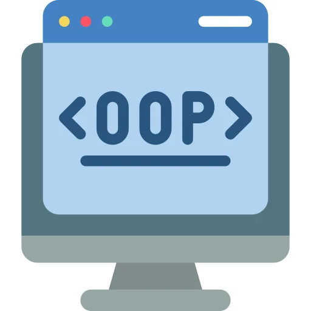
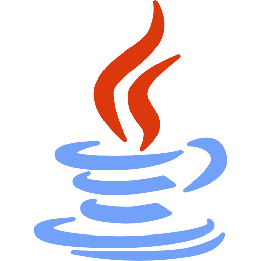

  

<h3>Back-End</h3>

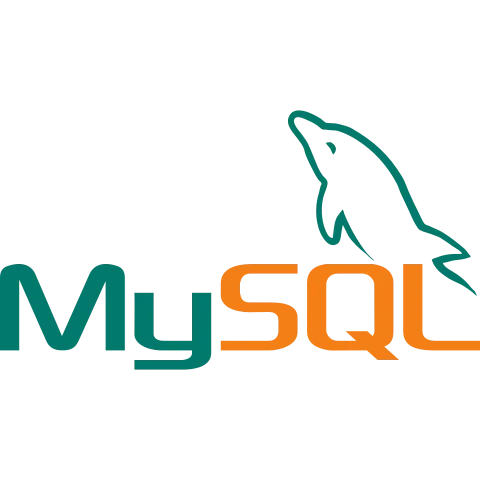

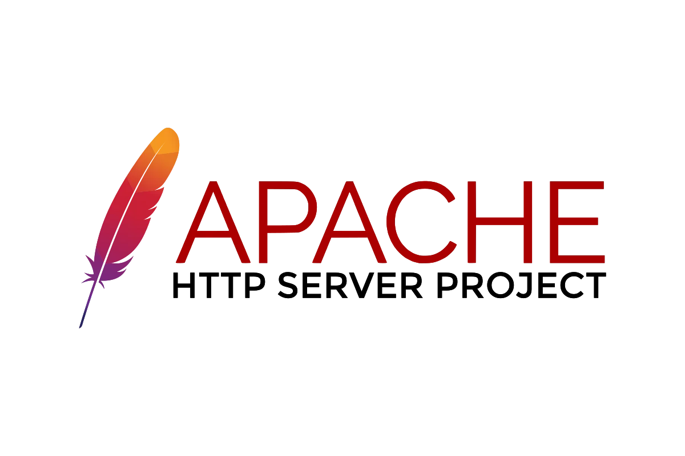
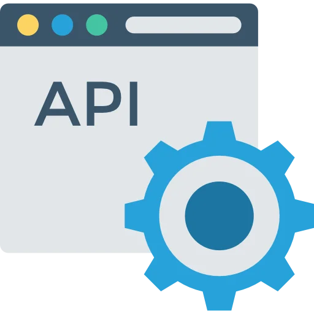

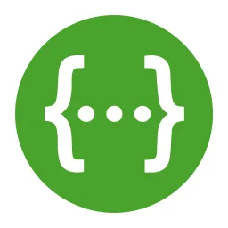

  

<h3>Front-End</h3>

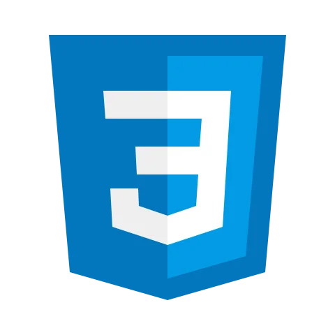

  

<h3>DevOps</h3>

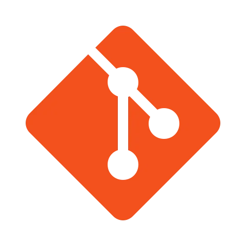

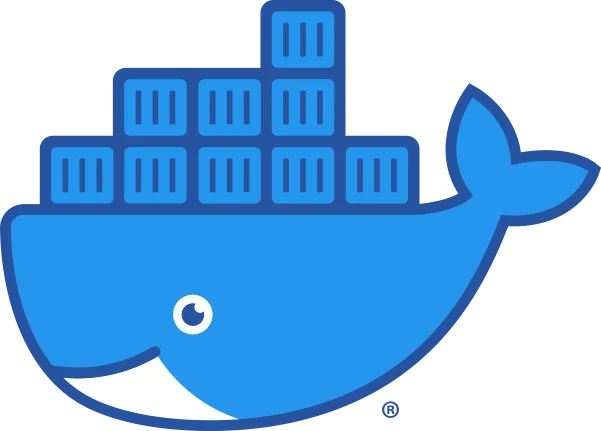

  

<h3>Tools</h3>

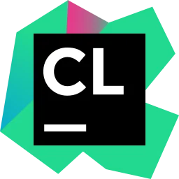
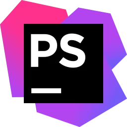

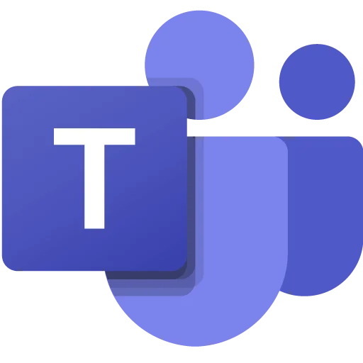

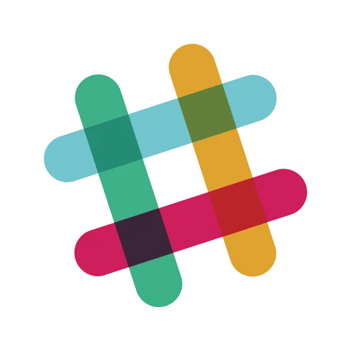

  

<h3 align="left">Latest YouTube Videos:</h3>

- [Session #1 - STLs (Linear Data Structure)](https://youtu.be/q_FXkla98Vo)
- [Session #2 - STLs (Non-Linear Data Structure)](https://youtu.be/E3N6p3cV5YU)
- [Session #3 - Number Theory](https://youtu.be/JaGdOl4cn_0)

    
	   
 

 

	

> **_*All Documentations Are Created By Me, So If It Is Going To Help You,
Please Mark The Repo As Star Or Fork It .. Happy Learning ʕ•́ᴥ•̀ʔ_**

	

[website]:https://www.ahmedarafat.vip/Home
[facebook]:https://www.facebook.com/AhmedArafat01
[youtube]: https://youtube.com/channel/UCqXUeSCLARmWOJEBUBPVNIg
[instagram]: https://www.instagram.com/ahmedarafat__/
[linkedin]: https://www.linkedin.com/in/ahmed-mohamed-yousry-0101/