<!-- Profile Header GIF -->

  

<h1 align="center">
  👋 Hello, I'm <i style="color:#36BCF7">Ahmed Mohamed Yousry</i>
    
  aka <i>Ahmed Arafat</i>
</h1>

<h4 align="center">Backend Engineer | Scalable Systems & API Architecture | ACPC Finalist</h4>

---

<!-- Typing SVG -->

  

---

Summary

 

Backend Engineer with **4+** years of experience building scalable data-intensive systems and high-performance APIs
across government and enterprise platforms in Egypt, Saudi Arabia, the USA, and Australia. Delivered **17+ projects**,
**1,000+ API endpoints** serving **50,000+ users** and handling **1M+ requests**. **ACPC Finalist** with **1,000+
solved** algorithmic problems.

---

Work Experience

 

- Backend Engineer (Laravel/PHP) @ **Next Economics & Technology Inc.**
- Backend Engineer (Laravel/PHP) @ **Grand Technology Inc.**
- Co-Founder & Back-End Developer @ **InnovaDigit Solutions**
- Teaching Assistant @ **BIS, Capital University**

---

Education

 

- 🎓 **MSc**, Postgraduate Business Information Systems (PBIS), Capital University — CGPA 3.7, 1st Rank
- 🎓 **Bachelor of Business Information Systems (BIS)**, Capital University — CGPA 3.94, Excellent with Honors, 1st Rank
  in Batch
- 🏅 Graduation Project **K-Hub** (A+, Best Project in College)

---

Projects

 

- <a href="https://ahmedarafat.vip/Portfolio/php/ProjectDocs.php?projectId=1&platform=GitHub" target="_blank">FilmSA –
  Saudi Filming Platform</a>

- <a href="https://ahmedarafat.vip/Portfolio/php/ProjectDocs.php?projectId=2&platform=GitHub" target="_blank">DAEM –
  Strategic Planning & Intelligence System</a>

- <a href="https://ahmedarafat.vip/Portfolio/php/ProjectDocs.php?projectId=4&platform=GitHub" target="_blank">Buy2 –
  Employee & KPI Management</a>

- <a href="https://ahmedarafat.vip/Portfolio/php/ProjectDocs.php?projectId=3&platform=GitHub" target="_blank">Uniters
  Academy – Multi-level Marketing Platform</a>

- <a href="https://ahmedarafat.vip/Portfolio/php/ProjectDocs.php?projectId=5&platform=GitHub" target="_blank">GPMS –
  Graduation Projects Management System</a>

- <a href="https://ahmedarafat.vip/Portfolio/php/ProjectDocs.php?projectId=6&platform=GitHub" target="_blank">SRS –
  Sections Registration System</a>

- <a href="https://ahmedarafat.vip/Portfolio/php/ProjectDocs.php?projectId=12&platform=GitHub" target="_blank">Laravel
  All-In-One Toolkit (Open-Source Package)</a>

- <a href="https://ahmedarafat.vip/Portfolio/php/ProjectDocs.php?projectId=9&platform=GitHub" target="_blank">TSCMS –
  Tech Schools Control Management System</a>

- <a href="https://ahmedarafat.vip/Portfolio/php/ProjectDocs.php?projectId=8&platform=GitHub" target="_blank">DT
  Requirements – Digital Transformation Compliance Platform</a>

- <a href="https://ahmedarafat.vip/Portfolio/php/ProjectDocs.php?projectId=7&platform=GitHub" target="_blank">K-Hub –
  Knowledge Sharing Platform</a>

- <a href="https://ahmedarafat.vip/Portfolio/php/ProjectDocs.php?projectId=11&platform=GitHub" target="_blank">PHP MVC
  Framework</a>

- <a href="https://ahmedarafat.vip/Portfolio/php/ProjectDocs.php?projectId=14&platform=GitHub" target="_blank">POS
  System</a>

- <a href="https://ahmedarafat.vip/Portfolio/php/ProjectDocs.php?projectId=13&platform=GitHub" target="_blank">
  ReadyStack CRM</a>

---

Technical Documentation Repositories

 

I maintain detailed documentation while learning new technologies to reinforce my understanding and create reusable
references for future projects. These repositories capture practical concepts, best practices, implementation notes, and
real-world examples gathered throughout my software engineering journey.

### Finished

- [PHP8 Course Documentation]()
- [PHP Security Tips]()
- [STLs Library]()
- [Pointers in C/C++]()
- [Master Laravel 12 Framework]()
- [Postman Documentation]()
- [OpenAPI Specification & Swagger Documentation]()
- [Jenkins Documentation]()
- [GitHub Actions CI/CD Documentation]()
- [GraphQL Documentation]()
- [gRPC Documentation]()

### In-Progress

- [Apache Kafka Documentation]()
- [Docker Documentation]()
- [Elasticsearch Documentation]()
- [RabbitMQ Documentation]()

---

Internships

 

- Software Engineer Intern @ **Orange Digital Center (ODC)**
- DevOps Engineer Intern @ **Sprints**

---

Competitive Programming

 

- **1x** ACPC Finalist 2025
- **2x** ECPC Finalist
- **1,000+** solved algorithmic problems

---

## 🤝 Connect With Me

  
  
  
  

---

## 🛠️ Languages & Tools

<h3>CS Core Skills</h3>

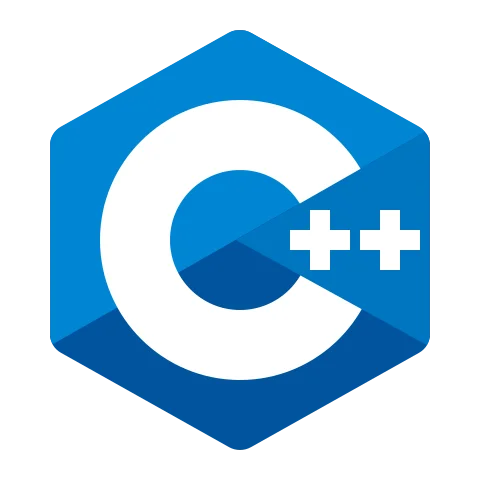
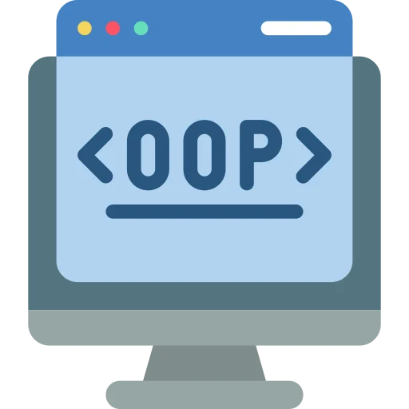
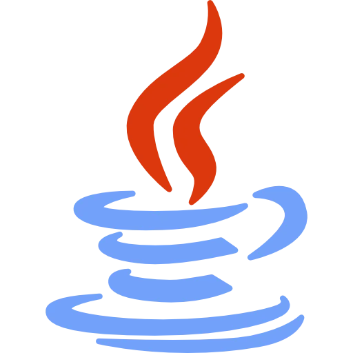
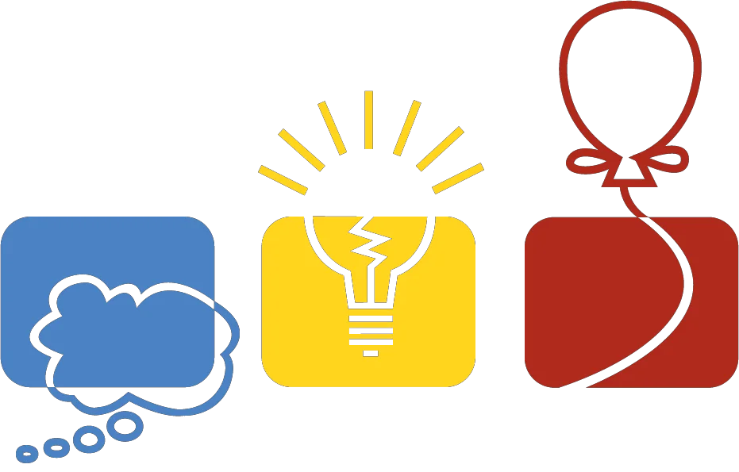

  

<h3>Back-End</h3>

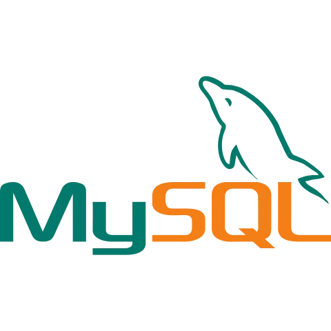
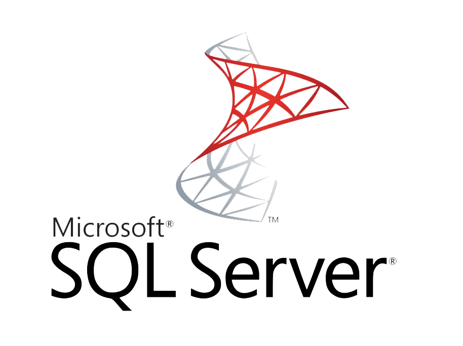
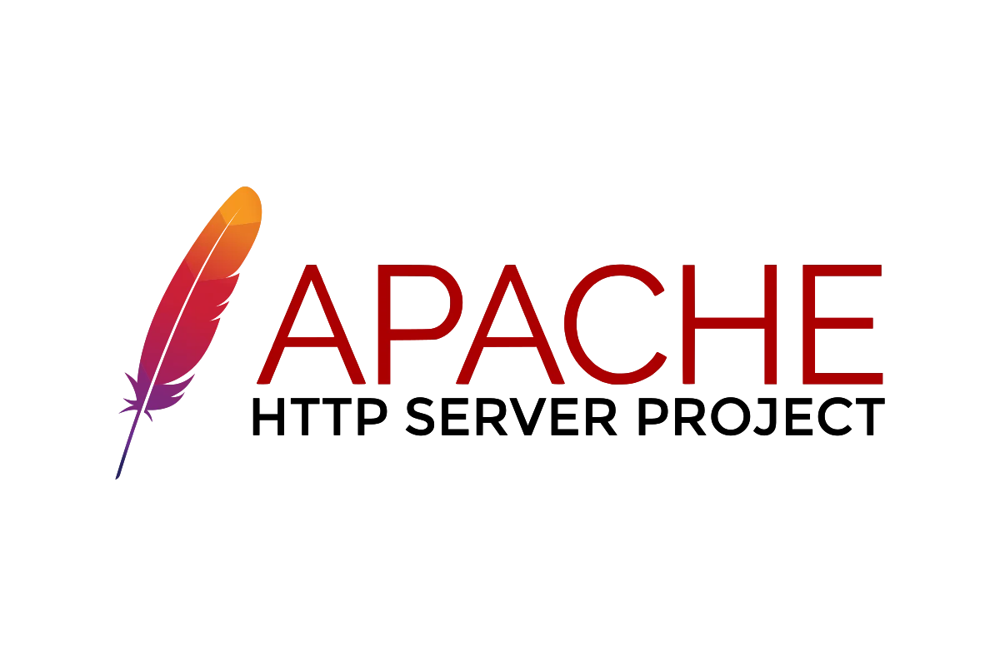
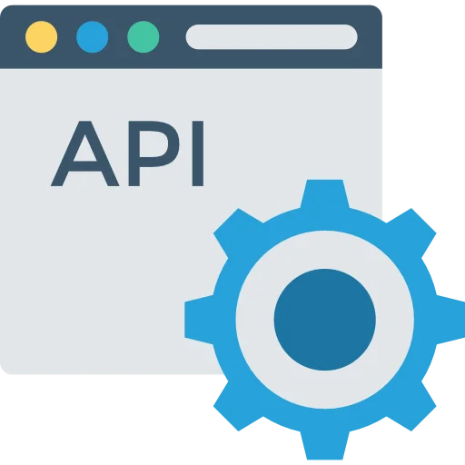
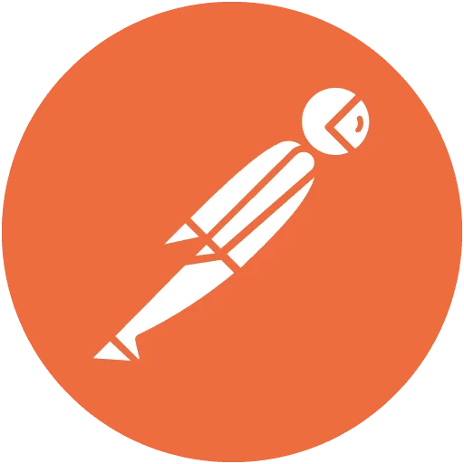
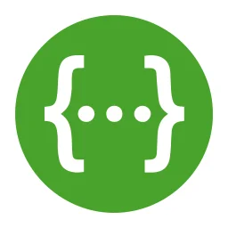

  

<h3>Front-End</h3>

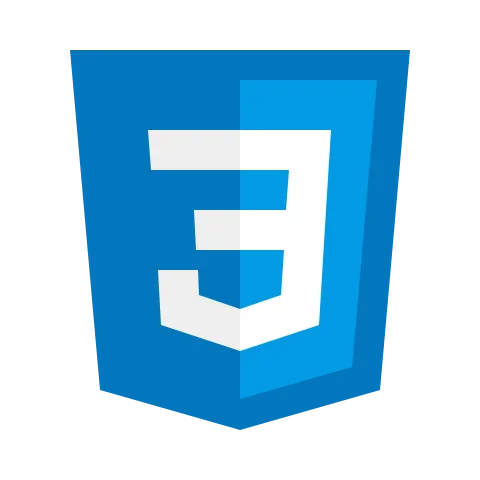
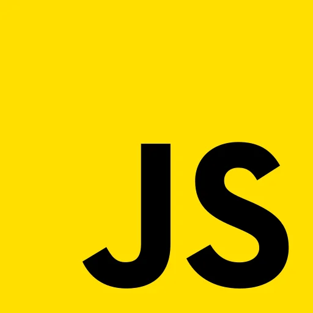

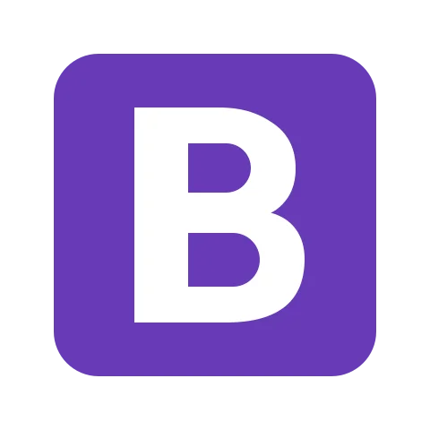

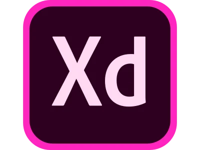

  

<h3>DevOps</h3>

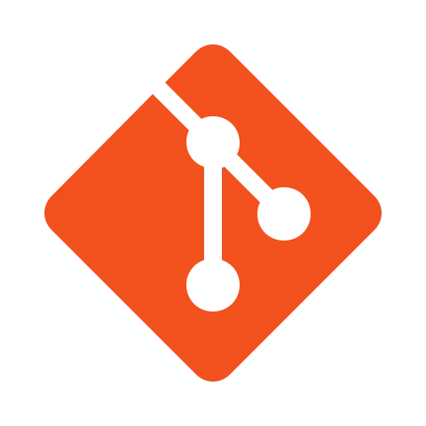

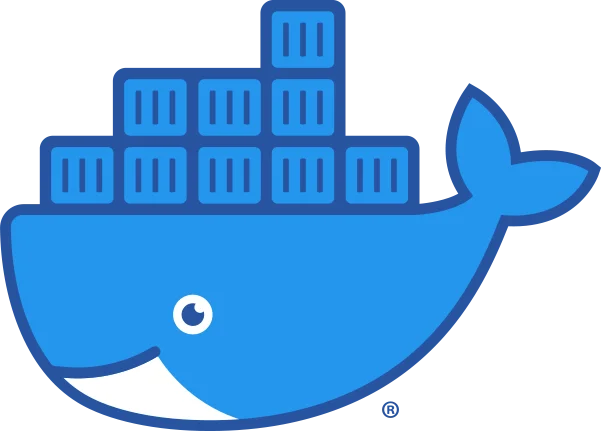

  

<h3>Tools</h3>

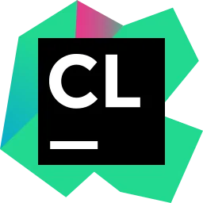
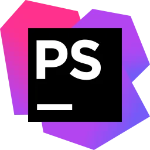
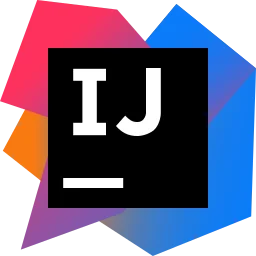

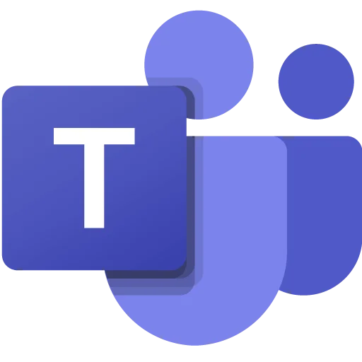

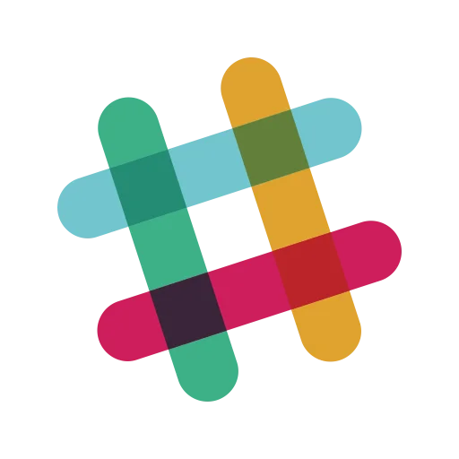

<h3>CS Core Skills</h3>

  

<h3>Back-End</h3>

  

<h3>Front-End</h3>

  

<h3>DevOps</h3>

  

<h3>Tools</h3>

  

---

## 📺 Latest YouTube Videos

- [Session #1 — STLs (Linear Data Structures)](https://youtu.be/q_FXkla98Vo)
- [Session #2 — STLs (Non-Linear Data Structures)](https://youtu.be/E3N6p3cV5YU)
- [Session #3 — Number Theory](https://youtu.be/JaGdOl4cn_0)

---

## 🧮 Problem-Solving Stats

  
  

---

## 📊 GitHub Stats

[//]: # (
)

[//]: # (  )

[//]: # (
)



---

## 💡 Quotes

  

  

---

> **All documentations are created by me.  
> If this helps you, please ⭐ or fork the repo.**

---

## 🕹️ Fun Zone

  

 

