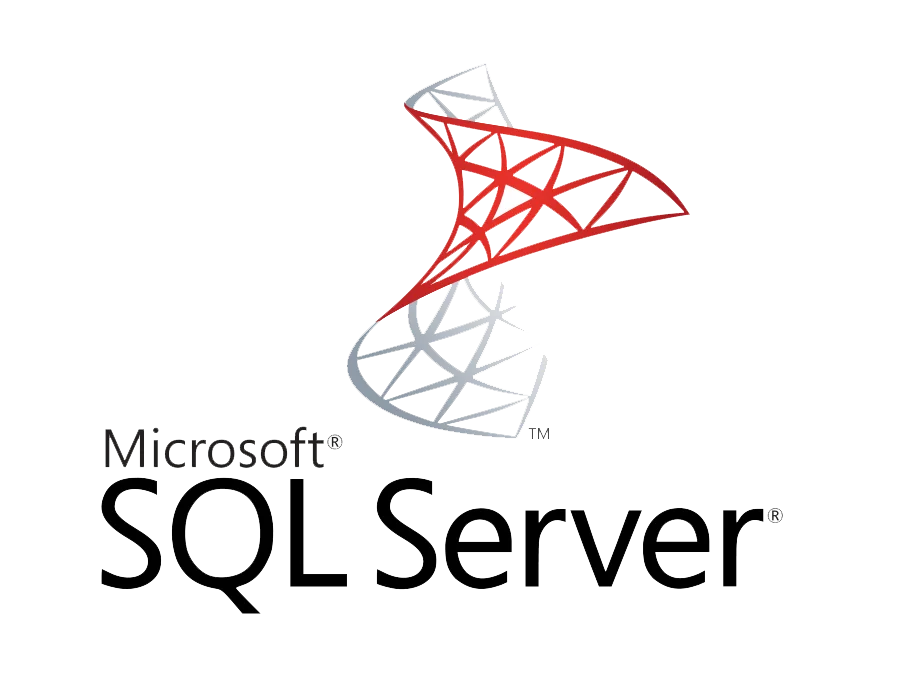

<!-- Profile Header GIF -->

  

---

## 👋 Hello There
## I'm **Ahmed Mohamed Yousry**
#### AKA **Ahmed Arafat**

---

<!-- Typing SVG -->

  

---

### 🎓 Education
- Bachelor of **Business Information System (BIS)**, Helwan University (El-Zamalek).  
  _Field: Computer Science & Business Administration_

### 💼 Work Experience
- Software Engineer @ `Grand Tech` (Egypt Branch)
- Coach & Instructor @ `Coach Academy`
- Teaching Assistant @ `ERU` (_Egyptian Russian University_)
- Teaching Assistant @ `CIC` (_Canadian International College_)

### 🌱 Extracurricular Experience
- Participant — Data Structure Marathon @ `Orange Digital Center (ODC)`
- Participant — Back-End Hackathon @ `Orange Digital Center (ODC)`

### 🏢 Internships
- Software Engineer Intern @ `Orange Digital Center (ODC)`
- DevOps Engineer Intern @ `Sprints`

### 🏆 Competitive Programming
- Contestant @ `ACM ECPC`
- Instructor @ `ICPC FCI-Helwan` Community (Level 2)
- Trainee @ `ICPC FCI-Helwan` Community (Top #3, Levels 1&2)

### 🎯 Student Activities
- Web Developer Member @ `GDSC`
- Web Development Delegate @ `ThreeDos`
- HR Member @ `ThreeDos`
- IT Member @ `MSP (Microsoft Student Partner)`
- Participant @ `SCCI`

---

### ❤️ About Me
- Passionate about the Software Industry
- Interests: `Software Engineering` | `Competitive Programming` | `Back-End Development`
- Self-taught Programmer
- 💬 Ask me about **C++ · DSA · PHP · Laravel · MySQL · Back-End Development**
- ✨ Motto: _"I Haven't Arrived Yet… But I'm Closer Than I Was Yesterday ❤"_
- Currently focused on **deepening vertical knowledge growth**

---

### 🤝 Connect With Me

  
  
  
  

---

## 🛠️ Languages & Tools

### 📘 CS Core Skills

  
  
  
  
  

### ⚙️ Back-End

  
  
  
  
  
  
  
  

### 🎨 Front-End

  
  
  
  
  
  
  

### ☁️ DevOps

  
  
  
  
  
  

### 🧰 Tools

  
  
  
  
  
  
  
  

---

### 📺 Latest YouTube Videos
- [Session #1 — STLs (Linear Data Structures)](https://youtu.be/q_FXkla98Vo)
- [Session #2 — STLs (Non-Linear Data Structures)](https://youtu.be/E3N6p3cV5YU)
- [Session #3 — Number Theory](https://youtu.be/JaGdOl4cn_0)

---

## 📊 GitHub Stats

  

  
  

---

## 💡 Quotes

  

  

---

> **All documentations are created by me.  
> If this helps you, please ⭐ or fork the repo.**

---

  

---

## 🕹️ Fun Zone

 

---

## 🧮 Problem-Solving Stats

  
  

