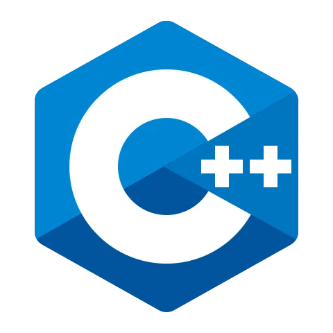
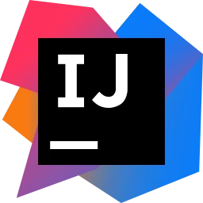

<!-- Profile Header GIF -->

  

<h1 align="center">👋 Hello, I'm Ahmed Mohamed Yousry</h1>
<h3 align="center">aka <i>Ahmed Arafat</i></h3>
<h4 align="center">Software Engineer | Back-End Developer | Competitive Programmer | Teaching Assistant | Freelancer</h4>

---

<!-- Typing SVG -->

  

---

🯠Summary

 

A **Software Engineer & Teaching Assistant** with 2+ years of work experience on projects in Egypt, Saudi Arabia, USA &
Australia, plus 4 years of learning experience during college.

- Passionate about **Software Development & Competitive Programming**
- Polymath, always evolving, committed, patient & disciplined team player
- Currently focusing on **DSA, Databases, Back-End Skills & Vertical Growth**

---

💼 Work Experience

 

- Mid-Level Laravel Back-End Developer @**Next Economics & Technology Inc.**
- Junior Laravel Back-End Developer @**Grand Technology Inc.**
- Teaching Assistant @**BIS, Helwan University**
- Co-Founder & Back-End Developer @**InnovaDigit Solutions**
- Coach & Instructor @**Coach Academy**
- Teaching Assistant @**CIC (Canadian International College)**
- Teaching Assistant @**ERU (Egyptian Russian University)**

---

📠Education

 

- 🎓 **MSc (In-progress)**, Postgraduate Business Information Systems (PBIS), Helwan University — CGPA 3.7, 1st Rank
- 🎓 **Bachelor of Business Information Systems (BIS)**, Helwan University — CGPA 3.94, Excellent with Honors, 1st Rank
  in Batch
- 🏅 Graduation Project **K-Hub** (A+, Best Project in College)

---

🚀 Projects

 

- **TSCMS** – Tech Schools Control Management System
- **SPI** – Strategic Planning & Intelligence System
- **FilmSA** – Saudi Filming Platform
- **WinLife** – Multi-level marketing app
- **Buy2** – Employee & KPI Management
- **K-Hub** – Graduation Project
- **POS System**
- **Automated Attendance System**
- **Blog & Portfolio Website**
- **ReadyStack CRM**
- **Financial Calculator**
- **Encryption Algorithms**
- **AI Tic-Tac-Toe**

👉 [Full Projects & Links](https://www.ahmedarafat.vip)

---

🌱 Internships

 

- Software Engineer Intern @**Orange Digital Center (ODC)**
- DevOps Engineer Intern @**Sprints**
- Virtual Summer Intern @**CIB Bank**

---

🆠Competitive Programming

 

- Contestant @**ACM ECPC**
- Instructor @**ICPC FCI-Helwan** Community - Level 2
- Trainee @**ICPC FCI-Helwan** Community - Level 1&2 (`Top #3`)

---

👨‍💻 Student Activities

 

- Web Developer Member @**Google Developer Student Club (GDSC)**
- Web Development Delegate @**ThreeDos**
- HR Member @**ThreeDos**
- IT Member @**Microsoft Student Partner (MSP)**
- Participant @**SCCI**

---

🶠Interests

 

📖 Reading Books · 🏋 Exercising · 🎮 Gaming · 🎹 Piano & Flute · 🎬 Anime & Movies

---

## 🤝 Connect With Me

  
  
  
  

---

## 🛠️ Languages & Tools

<h3>CS Core Skills</h3>

  

<h3>Back-End</h3>

  

<h3>Front-End</h3>

  

<h3>DevOps</h3>

  

<h3>Tools</h3>

<h3>CS Core Skills</h3>

  

<h3>Back-End</h3>

  

<h3>Front-End</h3>

  

<h3>DevOps</h3>

  

<h3>Tools</h3>

  

---

## 📺 Latest YouTube Videos

- [Session #1 — STLs (Linear Data Structures)](https://youtu.be/q_FXkla98Vo)
- [Session #2 — STLs (Non-Linear Data Structures)](https://youtu.be/E3N6p3cV5YU)
- [Session #3 — Number Theory](https://youtu.be/JaGdOl4cn_0)

---

## 🧮 Problem-Solving Stats

  
  

---

## 📊 GitHub Stats

[//]: # (
)

[//]: # (  )

[//]: # (
)

  
  

---

## 💡 Quotes

  

  

---

> **All documentations are created by me.  
> If this helps you, please ⭐ or fork the repo.**

---

  

---

## 🕹️ Fun Zone

 

